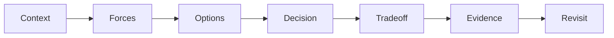

# Design Pattern Interviews

Kho câu hỏi phỏng vấn theo level, có câu trả lời, cách ghi điểm, câu hỏi đào sâu và scenario thực hành.

## Lộ trình

1. [Junior](01-junior.md): intent, nhận diện và so sánh cơ bản.
2. [Middle](02-middle.md): refactoring, testing và collaboration.
3. [Senior](03-senior.md): boundary, distributed failure và migration.
4. [Tech Lead](04-tech-lead.md): governance, mentoring và production evidence.
5. [Live scenarios](05-live-design-scenarios.md): thiết kế trực tiếp trên bảng.
6. [Interview playbook](06-interview-playbook.md): cấu trúc câu trả lời và rubric.

## Phương pháp luyện

- Trả lời bằng ví dụ từ dự án hoặc case study trong repo.
- Mỗi câu luôn nêu baseline trực tiếp và trường hợp không dùng pattern.
- Vẽ tối thiểu một dependency/sequence/state diagram cho câu system design.
- Ghi âm 5 phút, tự chấm theo Context → Invariant → Forces → Decision → Evidence → Migration.

## Definition of Done

Bạn hoàn thành level khi có thể giải thích intent không học thuộc, nhận diện failure/trade-off, viết test strategy và bảo vệ quyết định trước phản biện.

## Ma trận năng lực theo level

| Năng lực | Junior | Middle | Senior | Tech Lead |
|---|---|---|---|---|
| Nhận diện intent | Giải thích bằng ví dụ đơn giản | So sánh pattern gần nhau | Đánh giá pattern theo failure và boundary | Chuẩn hóa cách ra quyết định cho team |
| Refactoring | Tách conditional nhỏ | Dùng safety net và contract test | Thiết kế migration/rollback | Chọn chiến lược rollout và governance |
| Testing | Unit test observable behavior | Contract/integration test | Property, failure-injection, compatibility | Xây quality gate và review rubric |
| Production | Biết retry không luôn an toàn | Nêu idempotency và transaction | Thiết kế reconciliation, SLO, runbook | Đánh giá operability và ownership |
| Communication | Nêu intent và trade-off | Trình bày alternative | Bảo vệ decision bằng evidence | Facilitate review và mentor người khác |

## Kế hoạch luyện 4 tuần

### Tuần 1 — Intent và vocabulary

Mỗi ngày chọn hai pattern, trả lời ba câu: vấn đề gì, collaboration nào, khi nào không dùng. Kết thúc tuần bằng cách so sánh Strategy–State, Adapter–Facade và Decorator–Proxy.

### Tuần 2 — Refactoring và testing

Dùng examples/kata trong repo để refactor một conditional, một external SDK boundary và một lifecycle. Mỗi bài phải có characterization test hoặc contract test trước khi sửa.

### Tuần 3 — Production design

Luyện ba scenario trong [Live Design Scenarios](05-live-design-scenarios.md). Bắt buộc đề cập source of truth, transaction boundary, duplicate/timeout, metric và rollback.

### Tuần 4 — Mock interview

Thực hiện hai buổi 60 phút theo [Interview Playbook](06-interview-playbook.md). Sau mỗi buổi, ghi ba điểm: câu trả lời thiếu evidence, diagram chưa rõ ownership và trade-off chưa được nói thẳng.

## Rubric tự chấm câu trả lời

| Tiêu chí | 0 điểm | 1 điểm | 2 điểm |
|---|---|---|---|
| Context | Không có bối cảnh | Có ví dụ nhưng mơ hồ | Có actor, outcome và constraint |
| Invariant | Không nhắc | Nêu rule chung | Nêu điều luôn phải đúng và transaction owner |
| Alternative | Chỉ nói một pattern | Có một lựa chọn khác | Có baseline trực tiếp và lý do loại/chọn |
| Failure | Chỉ happy path | Nêu lỗi chung | Phân loại timeout, duplicate, conflict, rollback |
| Evidence | Không có | Nói test chung | Nêu test/metric/incident cụ thể |
| Migration | Không đề cập | Nói rollout | Có cohort, stop condition, rollback, cleanup |

## Cách dùng cho interviewer

- Chọn câu hỏi theo level nhưng điều chỉnh theo kinh nghiệm thực tế của ứng viên.
- Hỏi sâu vào một ví dụ thay vì hỏi thuộc lòng nhiều định nghĩa.
- Không trừ điểm vì ứng viên quên tên pattern nếu collaboration và trade-off đúng.
- Ghi nhận khả năng nói “không cần pattern” khi baseline trực tiếp đủ tốt.
- Với Senior/Tech Lead, yêu cầu evidence, migration và operability; chỉ vẽ class diagram là chưa đủ.

## Ma trận năng lực enterprise

| Cấp độ | Điều interviewer cần nghe | Evidence mạnh |
|---|---|---|
| Junior | hiểu intent và nhận diện code smell | ví dụ nhỏ + unit test |
| Middle | so sánh alternatives và trade-off | refactor journey + contract test |
| Senior | boundary, migration, failure và operability | ADR + rollout + metric + rollback |
| Tech Lead | governance, ownership và tổ chức học tập | review rubric + incident/postmortem |

## Cấu trúc trả lời có chiều sâu

Một câu trả lời tốt không kết thúc ở tên pattern. Hãy nêu baseline đơn giản hơn, lý do baseline không còn đủ, cách kiểm chứng pattern, failure mới do abstraction tạo ra và điều kiện gỡ bỏ pattern khi assumption thay đổi.

## Rubric chấm câu trả lời enterprise

| Năng lực | Dấu hiệu đạt | Dấu hiệu cần đào sâu |
|---|---|---|
| Problem framing | Làm rõ invariant và change axis | Nhảy thẳng vào tên pattern |
| Alternatives | So sánh baseline và ít nhất một lựa chọn khác | Chỉ nêu một “best practice” |
| Failure reasoning | Nói về timeout, duplicate, stale state, partial commit | Chỉ mô tả happy path |
| Evidence | Nêu test, metric, rollout và rollback | Kết luận bằng cảm tính |
| Communication | Nêu giả định và giới hạn | Dùng thuật ngữ để che phần chưa biết |

Một câu trả lời tốt không cần dài, nhưng phải nối được quyết định với evidence và điều kiện xem xét lại.
