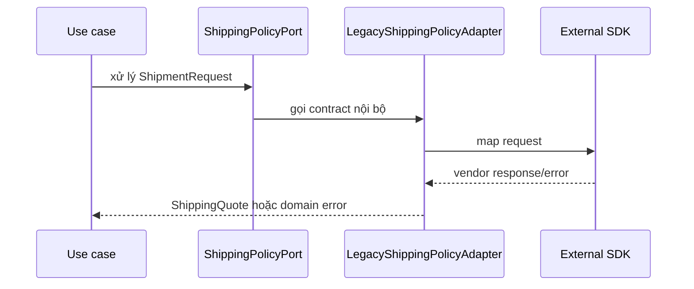

# Kata 27: Adapter trong Shipping

## Bối cảnh và lý do chọn bài

Module **Shipping** đang tính phí và ETA theo vùng. Invariant bắt buộc là **không chọn service không hỗ trợ địa chỉ**; failure cần quan sát là **carrier timeout hoặc rounding sai**. Kata này dùng **Adapter** để luyện cách dịch contract của SDK/hệ thống ngoài sang ngôn ngữ nội bộ tại một boundary duy nhất. Đây là tình huống tổng hợp phục vụ học tập, không giả định có một đề bài ẩn khác.

## Code smell cần tìm

Hãy dựng hoặc đọc starter code và đánh dấu nơi `'ShippingService'` vừa điều phối use case, vừa biết concrete detail thuộc change axis của **Adapter**. Dấu hiệu cần refactor không phải method dài đơn thuần, mà là mỗi lần thay đổi Shipping đều buộc sửa cùng nhánh, cùng dependency hoặc cùng lifecycle logic.

## Mục tiêu thiết kế

Adapter implement target port, map dữ liệu và translate error của adaptee. Sau refactor, client phải biết ít concrete detail hơn và invariant **không chọn service không hỗ trợ địa chỉ** vẫn được bảo vệ.

## Acceptance criteria

- Characterization test khóa behavior hiện tại trước khi thay cấu trúc.
- Test từ chối trường hợp vi phạm **không chọn service không hỗ trợ địa chỉ**.
- Failure **carrier timeout hoặc rounding sai** có exception/result rõ với caller, không silent fallback.
- Có scenario thứ hai chứng minh extension point của **Adapter** mà không sửa orchestration ổn định.
- Test trọng tâm: contract test mapping request/response, timeout, malformed payload và vendor error code.
- README lời giải nêu trade-off và điều kiện không nên dùng: adapter chứa business rule hoặc che giấu lỗi cần caller xử lý.

## Hướng dẫn từng bước

1. Chạy `solution.php` hoặc starter hiện có; ghi output, exception và side effect.
2. Viết test cho happy path của **Shipping**, invariant **không chọn service không hỗ trợ địa chỉ** và failure **carrier timeout hoặc rounding sai**.
3. Vẽ dependency/collaboration trước refactor; khoanh đúng change axis mà **Adapter** sẽ bảo vệ.
4. Tách một responsibility mỗi lần, chạy test sau từng thay đổi; chưa đổi public API nếu chưa cần.
5. Thêm biến thể thứ hai hoặc fault injection đặc trưng cho Shipping.
6. Vẽ sơ đồ sau refactor và so sánh concrete detail nào biến mất khỏi client.
7. Ghi một đoạn ngắn giải thích vì sao thiết kế trực tiếp có thể tốt hơn nếu adapter chứa business rule hoặc che giấu lỗi cần caller xử lý.

## Sơ đồ mục tiêu



Sơ đồ mô tả đúng cơ chế **Adapter** trong miền **Shipping**. Khi triển khai, hãy giữ invariant: **phí và SLA phản ánh đúng tuyến giao**. Participant trong sơ đồ là vocabulary gợi ý; đổi tên được, nhưng hướng phụ thuộc và failure boundary không được đảo ngược.

## Câu hỏi review

1. Change axis của **Adapter** trong Shipping có bằng chứng từ requirement hay chỉ là dự đoán?
2. Test nào sẽ thất bại nếu concrete detail quay lại `'ShippingService'`?
3. Failure **carrier timeout hoặc rounding sai** được translate ở boundary nào?
4. Metric/log nào phát hiện vi phạm **không chọn service không hỗ trợ địa chỉ** trong production?
5. Chi phí type, wiring và call flow có nhỏ hơn rủi ro **adapter chứa business rule hoặc che giấu lỗi cần caller xử lý** không?

## Gợi ý lời giải

Bắt đầu từ behavior contract thay vì tên participant trong sách. Với **Adapter**, hãy chứng minh `contract test mapping request/response, timeout, malformed payload và vendor error code` trước khi tối ưu cấu trúc. Lời giải tốt nhất là lời giải nhỏ nhất làm rõ ownership, invariant và failure semantics của Shipping.

## Chạy

```bash
php kata/027-adapter-shipping/solution.php
```

## Tài liệu liên quan

- Bài liên quan trực tiếp: **Adapter** trong **Shipping**; dùng liên kết dưới đây để đối chiếu lý thuyết và bài thực hành.
- [Design Pattern overview](../../OVERVIEW.md)
- [Core pattern articles](../../docs/README.md)
- [Exercises có lời giải](../../exercises/README.md)
- [Playground](../../playground/README.md)
