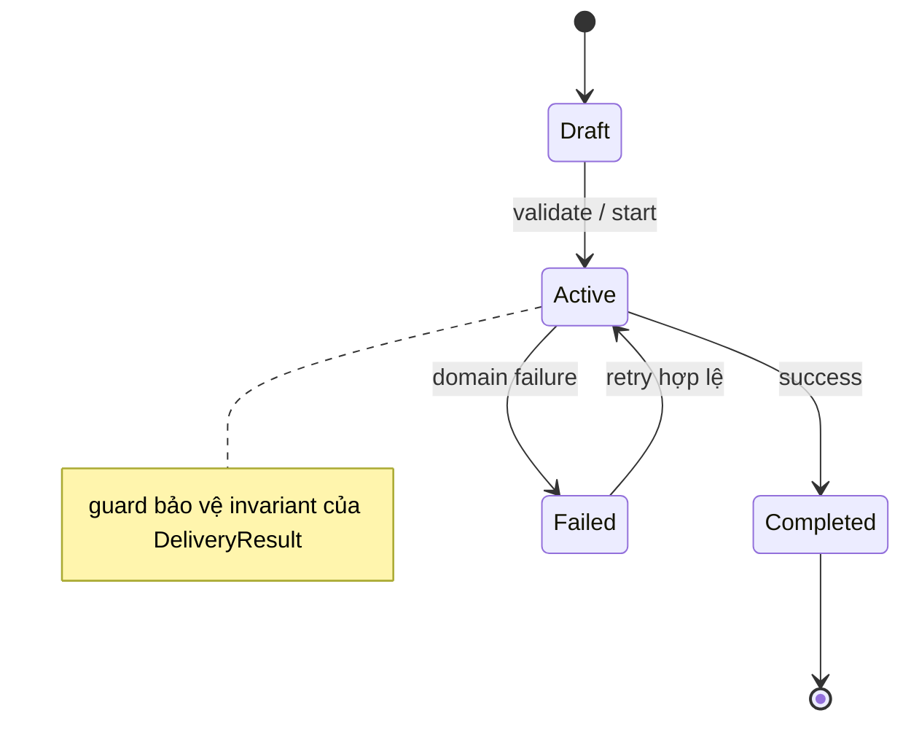

# Kata 42: State trong Email

## Bối cảnh và lý do chọn bài

Module **Email** đang gửi email giao dịch theo template và locale. Invariant bắt buộc là **không gửi nhầm recipient hoặc lộ dữ liệu**; failure cần quan sát là **provider accepted nhưng delivery thất bại**. Kata này dùng **State** để luyện cách mô hình hóa behavior theo lifecycle và kiểm soát transition hợp lệ. Đây là tình huống tổng hợp phục vụ học tập, không giả định có một đề bài ẩn khác.

## Code smell cần tìm

Hãy dựng hoặc đọc starter code và đánh dấu nơi `'EmailService'` vừa điều phối use case, vừa biết concrete detail thuộc change axis của **State**. Dấu hiệu cần refactor không phải method dài đơn thuần, mà là mỗi lần thay đổi Email đều buộc sửa cùng nhánh, cùng dependency hoặc cùng lifecycle logic.

## Mục tiêu thiết kế

Context ủy quyền behavior cho current state hoặc transition policy; guard chặn transition sai. Sau refactor, client phải biết ít concrete detail hơn và invariant **không gửi nhầm recipient hoặc lộ dữ liệu** vẫn được bảo vệ.

## Acceptance criteria

- Characterization test khóa behavior hiện tại trước khi thay cấu trúc.
- Test từ chối trường hợp vi phạm **không gửi nhầm recipient hoặc lộ dữ liệu**.
- Failure **provider accepted nhưng delivery thất bại** có exception/result rõ với caller, không silent fallback.
- Có scenario thứ hai chứng minh extension point của **State** mà không sửa orchestration ổn định.
- Test trọng tâm: state-transition table, illegal transition và side effect chỉ xảy ra khi chuyển trạng thái thành công.
- README lời giải nêu trade-off và điều kiện không nên dùng: chỉ có vài trạng thái ổn định mà enum + table rõ hơn.

## Hướng dẫn từng bước

1. Chạy `solution.php` hoặc starter hiện có; ghi output, exception và side effect.
2. Viết test cho happy path của **Email**, invariant **không gửi nhầm recipient hoặc lộ dữ liệu** và failure **provider accepted nhưng delivery thất bại**.
3. Vẽ dependency/collaboration trước refactor; khoanh đúng change axis mà **State** sẽ bảo vệ.
4. Tách một responsibility mỗi lần, chạy test sau từng thay đổi; chưa đổi public API nếu chưa cần.
5. Thêm biến thể thứ hai hoặc fault injection đặc trưng cho Email.
6. Vẽ sơ đồ sau refactor và so sánh concrete detail nào biến mất khỏi client.
7. Ghi một đoạn ngắn giải thích vì sao thiết kế trực tiếp có thể tốt hơn nếu chỉ có vài trạng thái ổn định mà enum + table rõ hơn.

## Sơ đồ mục tiêu



Sơ đồ mô tả đúng cơ chế **State** trong miền **Email**. Khi triển khai, hãy giữ invariant: **không gửi trùng và không lộ dữ liệu nhạy cảm**. Participant trong sơ đồ là vocabulary gợi ý; đổi tên được, nhưng hướng phụ thuộc và failure boundary không được đảo ngược.

## Câu hỏi review

1. Change axis của **State** trong Email có bằng chứng từ requirement hay chỉ là dự đoán?
2. Test nào sẽ thất bại nếu concrete detail quay lại `'EmailService'`?
3. Failure **provider accepted nhưng delivery thất bại** được translate ở boundary nào?
4. Metric/log nào phát hiện vi phạm **không gửi nhầm recipient hoặc lộ dữ liệu** trong production?
5. Chi phí type, wiring và call flow có nhỏ hơn rủi ro **chỉ có vài trạng thái ổn định mà enum + table rõ hơn** không?

## Gợi ý lời giải

Bắt đầu từ behavior contract thay vì tên participant trong sách. Với **State**, hãy chứng minh `state-transition table, illegal transition và side effect chỉ xảy ra khi chuyển trạng thái thành công` trước khi tối ưu cấu trúc. Lời giải tốt nhất là lời giải nhỏ nhất làm rõ ownership, invariant và failure semantics của Email.

## Chạy

```bash
php kata/042-state-email/solution.php
```

## Tài liệu liên quan

- Bài liên quan trực tiếp: **State** trong **Email**; dùng liên kết dưới đây để đối chiếu lý thuyết và bài thực hành.
- [Design Pattern overview](../../OVERVIEW.md)
- [Core pattern articles](../../docs/README.md)
- [Exercises có lời giải](../../exercises/README.md)
- [Playground](../../playground/README.md)
