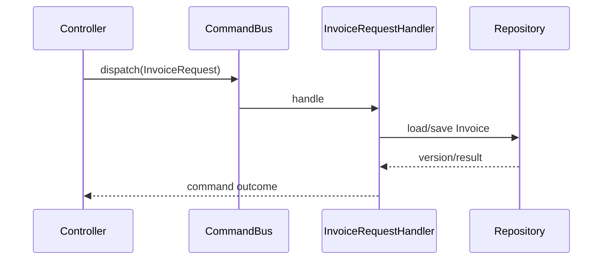

# Kata 43: Command trong Invoice

## Bối cảnh và lý do chọn bài

Module **Invoice** đang phát hành hóa đơn và gửi bản điện tử. Invariant bắt buộc là **số hóa đơn duy nhất và bản đã phát hành bất biến**; failure cần quan sát là **tax/rounding sai hoặc delivery thất bại**. Kata này dùng **Command** để luyện cách đóng gói business intent thành object để audit, queue, retry hoặc phân quyền rõ. Đây là tình huống tổng hợp phục vụ học tập, không giả định có một đề bài ẩn khác.

## Code smell cần tìm

Hãy dựng hoặc đọc starter code và đánh dấu nơi `'InvoiceService'` vừa điều phối use case, vừa biết concrete detail thuộc change axis của **Command**. Dấu hiệu cần refactor không phải method dài đơn thuần, mà là mỗi lần thay đổi Invoice đều buộc sửa cùng nhánh, cùng dependency hoặc cùng lifecycle logic.

## Mục tiêu thiết kế

Command chứa dữ liệu intent; handler điều phối use case và dependency. Sau refactor, client phải biết ít concrete detail hơn và invariant **số hóa đơn duy nhất và bản đã phát hành bất biến** vẫn được bảo vệ.

## Acceptance criteria

- Characterization test khóa behavior hiện tại trước khi thay cấu trúc.
- Test từ chối trường hợp vi phạm **số hóa đơn duy nhất và bản đã phát hành bất biến**.
- Failure **tax/rounding sai hoặc delivery thất bại** có exception/result rõ với caller, không silent fallback.
- Có scenario thứ hai chứng minh extension point của **Command** mà không sửa orchestration ổn định.
- Test trọng tâm: validation, authorization, idempotency key, retry và audit metadata.
- README lời giải nêu trade-off và điều kiện không nên dùng: command chỉ là DTO đổi tên hoặc mỗi method nhỏ đều tạo handler không cần thiết.

## Hướng dẫn từng bước

1. Chạy `solution.php` hoặc starter hiện có; ghi output, exception và side effect.
2. Viết test cho happy path của **Invoice**, invariant **số hóa đơn duy nhất và bản đã phát hành bất biến** và failure **tax/rounding sai hoặc delivery thất bại**.
3. Vẽ dependency/collaboration trước refactor; khoanh đúng change axis mà **Command** sẽ bảo vệ.
4. Tách một responsibility mỗi lần, chạy test sau từng thay đổi; chưa đổi public API nếu chưa cần.
5. Thêm biến thể thứ hai hoặc fault injection đặc trưng cho Invoice.
6. Vẽ sơ đồ sau refactor và so sánh concrete detail nào biến mất khỏi client.
7. Ghi một đoạn ngắn giải thích vì sao thiết kế trực tiếp có thể tốt hơn nếu command chỉ là DTO đổi tên hoặc mỗi method nhỏ đều tạo handler không cần thiết.

## Sơ đồ mục tiêu



Sơ đồ mô tả đúng cơ chế **Command** trong miền **Invoice**. Khi triển khai, hãy giữ invariant: **số tiền, thuế và trạng thái phát hành nhất quán**. Participant trong sơ đồ là vocabulary gợi ý; đổi tên được, nhưng hướng phụ thuộc và failure boundary không được đảo ngược.

## Câu hỏi review

1. Change axis của **Command** trong Invoice có bằng chứng từ requirement hay chỉ là dự đoán?
2. Test nào sẽ thất bại nếu concrete detail quay lại `'InvoiceService'`?
3. Failure **tax/rounding sai hoặc delivery thất bại** được translate ở boundary nào?
4. Metric/log nào phát hiện vi phạm **số hóa đơn duy nhất và bản đã phát hành bất biến** trong production?
5. Chi phí type, wiring và call flow có nhỏ hơn rủi ro **command chỉ là DTO đổi tên hoặc mỗi method nhỏ đều tạo handler không cần thiết** không?

## Gợi ý lời giải

Bắt đầu từ behavior contract thay vì tên participant trong sách. Với **Command**, hãy chứng minh `validation, authorization, idempotency key, retry và audit metadata` trước khi tối ưu cấu trúc. Lời giải tốt nhất là lời giải nhỏ nhất làm rõ ownership, invariant và failure semantics của Invoice.

## Chạy

```bash
php kata/043-command-invoice/solution.php
```

## Tài liệu liên quan

- Bài liên quan trực tiếp: **Command** trong **Invoice**; dùng liên kết dưới đây để đối chiếu lý thuyết và bài thực hành.
- [Design Pattern overview](../../OVERVIEW.md)
- [Core pattern articles](../../docs/README.md)
- [Exercises có lời giải](../../exercises/README.md)
- [Playground](../../playground/README.md)
