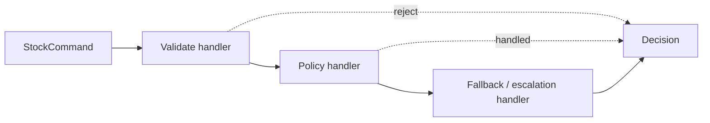

# Kata 56: Chain of Responsibility trong Inventory

## Bối cảnh và lý do chọn bài

Module **Inventory** đang reserve, release và adjust stock. Invariant bắt buộc là **available không âm**; failure cần quan sát là **concurrent reservation gây oversell**. Kata này dùng **Chain of Responsibility** để luyện cách tách các rule/handler có thể xử lý hoặc chuyển request cho bước kế tiếp. Đây là tình huống tổng hợp phục vụ học tập, không giả định có một đề bài ẩn khác.

## Code smell cần tìm

Hãy dựng hoặc đọc starter code và đánh dấu nơi `'InventoryService'` vừa điều phối use case, vừa biết concrete detail thuộc change axis của **Chain of Responsibility**. Dấu hiệu cần refactor không phải method dài đơn thuần, mà là mỗi lần thay đổi Inventory đều buộc sửa cùng nhánh, cùng dependency hoặc cùng lifecycle logic.

## Mục tiêu thiết kế

Ordered handlers cùng contract; mỗi handler sở hữu điều kiện nhận và short-circuit. Sau refactor, client phải biết ít concrete detail hơn và invariant **available không âm** vẫn được bảo vệ.

## Acceptance criteria

- Characterization test khóa behavior hiện tại trước khi thay cấu trúc.
- Test từ chối trường hợp vi phạm **available không âm**.
- Failure **concurrent reservation gây oversell** có exception/result rõ với caller, không silent fallback.
- Có scenario thứ hai chứng minh extension point của **Chain of Responsibility** mà không sửa orchestration ổn định.
- Test trọng tâm: ordering, short-circuit, unhandled request và mutation của payload.
- README lời giải nêu trade-off và điều kiện không nên dùng: ordering trở thành business rule ẩn và khó trace.

## Hướng dẫn từng bước

1. Chạy `solution.php` hoặc starter hiện có; ghi output, exception và side effect.
2. Viết test cho happy path của **Inventory**, invariant **available không âm** và failure **concurrent reservation gây oversell**.
3. Vẽ dependency/collaboration trước refactor; khoanh đúng change axis mà **Chain of Responsibility** sẽ bảo vệ.
4. Tách một responsibility mỗi lần, chạy test sau từng thay đổi; chưa đổi public API nếu chưa cần.
5. Thêm biến thể thứ hai hoặc fault injection đặc trưng cho Inventory.
6. Vẽ sơ đồ sau refactor và so sánh concrete detail nào biến mất khỏi client.
7. Ghi một đoạn ngắn giải thích vì sao thiết kế trực tiếp có thể tốt hơn nếu ordering trở thành business rule ẩn và khó trace.

## Sơ đồ mục tiêu



Sơ đồ mô tả đúng cơ chế **Chain** trong miền **Inventory**. Khi triển khai, hãy giữ invariant: **available không âm và ledger cân bằng**. Participant trong sơ đồ là vocabulary gợi ý; đổi tên được, nhưng hướng phụ thuộc và failure boundary không được đảo ngược.

## Câu hỏi review

1. Change axis của **Chain of Responsibility** trong Inventory có bằng chứng từ requirement hay chỉ là dự đoán?
2. Test nào sẽ thất bại nếu concrete detail quay lại `'InventoryService'`?
3. Failure **concurrent reservation gây oversell** được translate ở boundary nào?
4. Metric/log nào phát hiện vi phạm **available không âm** trong production?
5. Chi phí type, wiring và call flow có nhỏ hơn rủi ro **ordering trở thành business rule ẩn và khó trace** không?

## Gợi ý lời giải

Bắt đầu từ behavior contract thay vì tên participant trong sách. Với **Chain of Responsibility**, hãy chứng minh `ordering, short-circuit, unhandled request và mutation của payload` trước khi tối ưu cấu trúc. Lời giải tốt nhất là lời giải nhỏ nhất làm rõ ownership, invariant và failure semantics của Inventory.

## Chạy

```bash
php kata/056-chain-inventory/solution.php
```

## Tài liệu liên quan

- Bài liên quan trực tiếp: **Chain of Responsibility** trong **Inventory**; dùng liên kết dưới đây để đối chiếu lý thuyết và bài thực hành.
- [Design Pattern overview](../../OVERVIEW.md)
- [Core pattern articles](../../docs/README.md)
- [Exercises có lời giải](../../exercises/README.md)
- [Playground](../../playground/README.md)
