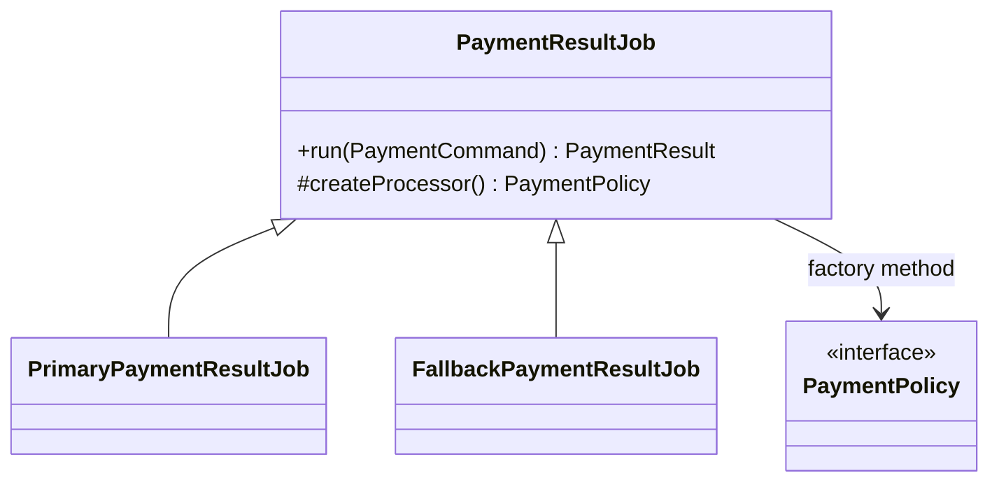

# Kata 62: Factory Method trong Payment

## Bối cảnh và lý do chọn bài

Module **Payment** đang authorize, capture và refund qua gateway. Invariant bắt buộc là **không charge trùng khi client retry**; failure cần quan sát là **gateway decline/timeout hoặc callback đến trễ**. Kata này dùng **Factory Method** để luyện cách để creator sở hữu workflow nhưng trì hoãn việc chọn concrete product cho factory method. Đây là tình huống tổng hợp phục vụ học tập, không giả định có một đề bài ẩn khác.

## Code smell cần tìm

Hãy dựng hoặc đọc starter code và đánh dấu nơi `'PaymentService'` vừa điều phối use case, vừa biết concrete detail thuộc change axis của **Factory Method**. Dấu hiệu cần refactor không phải method dài đơn thuần, mà là mỗi lần thay đổi Payment đều buộc sửa cùng nhánh, cùng dependency hoặc cùng lifecycle logic.

## Mục tiêu thiết kế

Concrete creator override bước tạo product; client gọi workflow chung thay vì switch theo type. Sau refactor, client phải biết ít concrete detail hơn và invariant **không charge trùng khi client retry** vẫn được bảo vệ.

## Acceptance criteria

- Characterization test khóa behavior hiện tại trước khi thay cấu trúc.
- Test từ chối trường hợp vi phạm **không charge trùng khi client retry**.
- Failure **gateway decline/timeout hoặc callback đến trễ** có exception/result rõ với caller, không silent fallback.
- Có scenario thứ hai chứng minh extension point của **Factory Method** mà không sửa orchestration ổn định.
- Test trọng tâm: test workflow chung, product contract và unsupported type/configuration.
- README lời giải nêu trade-off và điều kiện không nên dùng: subclass hierarchy chỉ để thay một lệnh `new` đơn giản.

## Hướng dẫn từng bước

1. Chạy `solution.php` hoặc starter hiện có; ghi output, exception và side effect.
2. Viết test cho happy path của **Payment**, invariant **không charge trùng khi client retry** và failure **gateway decline/timeout hoặc callback đến trễ**.
3. Vẽ dependency/collaboration trước refactor; khoanh đúng change axis mà **Factory Method** sẽ bảo vệ.
4. Tách một responsibility mỗi lần, chạy test sau từng thay đổi; chưa đổi public API nếu chưa cần.
5. Thêm biến thể thứ hai hoặc fault injection đặc trưng cho Payment.
6. Vẽ sơ đồ sau refactor và so sánh concrete detail nào biến mất khỏi client.
7. Ghi một đoạn ngắn giải thích vì sao thiết kế trực tiếp có thể tốt hơn nếu subclass hierarchy chỉ để thay một lệnh `new` đơn giản.

## Sơ đồ mục tiêu



Sơ đồ mô tả đúng cơ chế **Factory Method** trong miền **Payment**. Khi triển khai, hãy giữ invariant: **một idempotency key không tạo hai charge**. Participant trong sơ đồ là vocabulary gợi ý; đổi tên được, nhưng hướng phụ thuộc và failure boundary không được đảo ngược.

## Câu hỏi review

1. Change axis của **Factory Method** trong Payment có bằng chứng từ requirement hay chỉ là dự đoán?
2. Test nào sẽ thất bại nếu concrete detail quay lại `'PaymentService'`?
3. Failure **gateway decline/timeout hoặc callback đến trễ** được translate ở boundary nào?
4. Metric/log nào phát hiện vi phạm **không charge trùng khi client retry** trong production?
5. Chi phí type, wiring và call flow có nhỏ hơn rủi ro **subclass hierarchy chỉ để thay một lệnh `new` đơn giản** không?

## Gợi ý lời giải

Bắt đầu từ behavior contract thay vì tên participant trong sách. Với **Factory Method**, hãy chứng minh `test workflow chung, product contract và unsupported type/configuration` trước khi tối ưu cấu trúc. Lời giải tốt nhất là lời giải nhỏ nhất làm rõ ownership, invariant và failure semantics của Payment.

## Chạy

```bash
php kata/062-factory-method-payment/solution.php
```

## Tài liệu liên quan

- Bài liên quan trực tiếp: **Factory Method** trong **Payment**; dùng liên kết dưới đây để đối chiếu lý thuyết và bài thực hành.
- [Design Pattern overview](../../OVERVIEW.md)
- [Core pattern articles](../../docs/README.md)
- [Exercises có lời giải](../../exercises/README.md)
- [Playground](../../playground/README.md)
