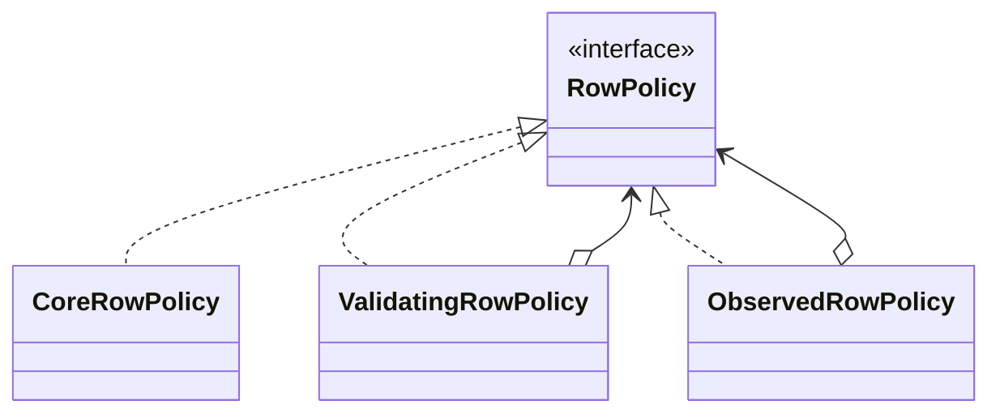

# Kata 100: Decorator trong Csv

## Bối cảnh và lý do chọn bài

Module **Csv** đang xử lý nghiệp vụ Csv. Invariant bắt buộc là **invariant của Csv**; failure cần quan sát là **failure path của Csv**. Kata này dùng **Decorator** để luyện cách ghép logging, retry, metrics hoặc validation quanh component mà không sửa implementation lõi. Đây là tình huống tổng hợp phục vụ học tập, không giả định có một đề bài ẩn khác.

## Code smell cần tìm

Hãy dựng hoặc đọc starter code và đánh dấu nơi `'CsvService'` vừa điều phối use case, vừa biết concrete detail thuộc change axis của **Decorator**. Dấu hiệu cần refactor không phải method dài đơn thuần, mà là mỗi lần thay đổi Csv đều buộc sửa cùng nhánh, cùng dependency hoặc cùng lifecycle logic.

## Mục tiêu thiết kế

Mỗi decorator giữ cùng contract, delegate và thêm behavior trước/sau lời gọi. Sau refactor, client phải biết ít concrete detail hơn và invariant **invariant của Csv** vẫn được bảo vệ.

## Acceptance criteria

- Characterization test khóa behavior hiện tại trước khi thay cấu trúc.
- Test từ chối trường hợp vi phạm **invariant của Csv**.
- Failure **failure path của Csv** có exception/result rõ với caller, không silent fallback.
- Có scenario thứ hai chứng minh extension point của **Decorator** mà không sửa orchestration ổn định.
- Test trọng tâm: test thứ tự wrapper, số lần delegate, retry boundary và exception propagation.
- README lời giải nêu trade-off và điều kiện không nên dùng: wrapper order mơ hồ hoặc call stack khó quan sát hơn lợi ích.

## Hướng dẫn từng bước

1. Chạy `solution.php` hoặc starter hiện có; ghi output, exception và side effect.
2. Viết test cho happy path của **Csv**, invariant **invariant của Csv** và failure **failure path của Csv**.
3. Vẽ dependency/collaboration trước refactor; khoanh đúng change axis mà **Decorator** sẽ bảo vệ.
4. Tách một responsibility mỗi lần, chạy test sau từng thay đổi; chưa đổi public API nếu chưa cần.
5. Thêm biến thể thứ hai hoặc fault injection đặc trưng cho Csv.
6. Vẽ sơ đồ sau refactor và so sánh concrete detail nào biến mất khỏi client.
7. Ghi một đoạn ngắn giải thích vì sao thiết kế trực tiếp có thể tốt hơn nếu wrapper order mơ hồ hoặc call stack khó quan sát hơn lợi ích.

## Sơ đồ mục tiêu



Sơ đồ mô tả đúng cơ chế **Decorator** trong miền **Csv**. Khi triển khai, hãy giữ invariant: **dòng lỗi không làm mất dấu dữ liệu nguồn**. Participant trong sơ đồ là vocabulary gợi ý; đổi tên được, nhưng hướng phụ thuộc và failure boundary không được đảo ngược.

## Câu hỏi review

1. Change axis của **Decorator** trong Csv có bằng chứng từ requirement hay chỉ là dự đoán?
2. Test nào sẽ thất bại nếu concrete detail quay lại `'CsvService'`?
3. Failure **failure path của Csv** được translate ở boundary nào?
4. Metric/log nào phát hiện vi phạm **invariant của Csv** trong production?
5. Chi phí type, wiring và call flow có nhỏ hơn rủi ro **wrapper order mơ hồ hoặc call stack khó quan sát hơn lợi ích** không?

## Gợi ý lời giải

Bắt đầu từ behavior contract thay vì tên participant trong sách. Với **Decorator**, hãy chứng minh `test thứ tự wrapper, số lần delegate, retry boundary và exception propagation` trước khi tối ưu cấu trúc. Lời giải tốt nhất là lời giải nhỏ nhất làm rõ ownership, invariant và failure semantics của Csv.

## Chạy

```bash
php kata/100-decorator-csv/solution.php
```

## Tài liệu liên quan

- Bài liên quan trực tiếp: **Decorator** trong **Csv**; dùng liên kết dưới đây để đối chiếu lý thuyết và bài thực hành.
- [Design Pattern overview](../../OVERVIEW.md)
- [Core pattern articles](../../docs/README.md)
- [Exercises có lời giải](../../exercises/README.md)
- [Playground](../../playground/README.md)
