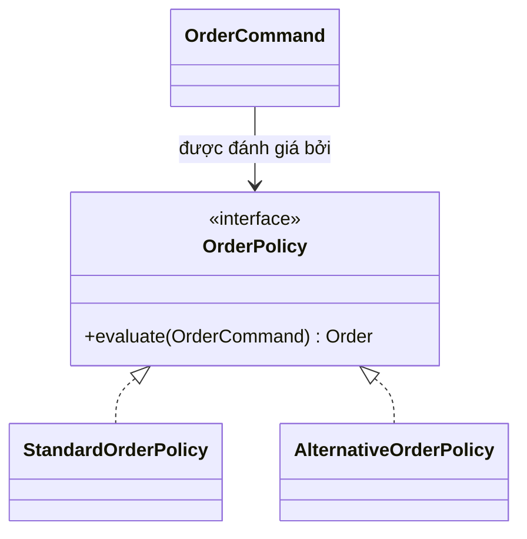

# Kata 157: Strategy trong Order

## Bối cảnh và lý do chọn bài

Module **Order** đang đặt hàng, reserve stock và xác nhận. Invariant bắt buộc là **không xác nhận đơn khi reserve thất bại**; failure cần quan sát là **side effect bị lặp khi retry workflow**. Kata này dùng **Strategy** để luyện cách tách policy/thuật toán có cùng contract để use case thay đổi policy mà không sửa orchestration. Đây là tình huống tổng hợp phục vụ học tập, không giả định có một đề bài ẩn khác.

## Code smell cần tìm

Hãy dựng hoặc đọc starter code và đánh dấu nơi `'OrderService'` vừa điều phối use case, vừa biết concrete detail thuộc change axis của **Strategy**. Dấu hiệu cần refactor không phải method dài đơn thuần, mà là mỗi lần thay đổi Order đều buộc sửa cùng nhánh, cùng dependency hoặc cùng lifecycle logic.

## Mục tiêu thiết kế

Context phụ thuộc policy contract; composition root hoặc factory chọn concrete strategy. Sau refactor, client phải biết ít concrete detail hơn và invariant **không xác nhận đơn khi reserve thất bại** vẫn được bảo vệ.

## Acceptance criteria

- Characterization test khóa behavior hiện tại trước khi thay cấu trúc.
- Test từ chối trường hợp vi phạm **không xác nhận đơn khi reserve thất bại**.
- Failure **side effect bị lặp khi retry workflow** có exception/result rõ với caller, không silent fallback.
- Có scenario thứ hai chứng minh extension point của **Strategy** mà không sửa orchestration ổn định.
- Test trọng tâm: contract test chạy trên mọi strategy, edge input và quy tắc rounding/return semantics.
- README lời giải nêu trade-off và điều kiện không nên dùng: số policy và wiring tăng trong khi chỉ có một nhánh ổn định.

## Hướng dẫn từng bước

1. Chạy `solution.php` hoặc starter hiện có; ghi output, exception và side effect.
2. Viết test cho happy path của **Order**, invariant **không xác nhận đơn khi reserve thất bại** và failure **side effect bị lặp khi retry workflow**.
3. Vẽ dependency/collaboration trước refactor; khoanh đúng change axis mà **Strategy** sẽ bảo vệ.
4. Tách một responsibility mỗi lần, chạy test sau từng thay đổi; chưa đổi public API nếu chưa cần.
5. Thêm biến thể thứ hai hoặc fault injection đặc trưng cho Order.
6. Vẽ sơ đồ sau refactor và so sánh concrete detail nào biến mất khỏi client.
7. Ghi một đoạn ngắn giải thích vì sao thiết kế trực tiếp có thể tốt hơn nếu số policy và wiring tăng trong khi chỉ có một nhánh ổn định.

## Sơ đồ mục tiêu



Sơ đồ mô tả đúng cơ chế **Strategy** trong miền **Order**. Khi triển khai, hãy giữ invariant: **transition hợp lệ và không mất audit trail**. Participant trong sơ đồ là vocabulary gợi ý; đổi tên được, nhưng hướng phụ thuộc và failure boundary không được đảo ngược.

## Câu hỏi review

1. Change axis của **Strategy** trong Order có bằng chứng từ requirement hay chỉ là dự đoán?
2. Test nào sẽ thất bại nếu concrete detail quay lại `'OrderService'`?
3. Failure **side effect bị lặp khi retry workflow** được translate ở boundary nào?
4. Metric/log nào phát hiện vi phạm **không xác nhận đơn khi reserve thất bại** trong production?
5. Chi phí type, wiring và call flow có nhỏ hơn rủi ro **số policy và wiring tăng trong khi chỉ có một nhánh ổn định** không?

## Gợi ý lời giải

Bắt đầu từ behavior contract thay vì tên participant trong sách. Với **Strategy**, hãy chứng minh `contract test chạy trên mọi strategy, edge input và quy tắc rounding/return semantics` trước khi tối ưu cấu trúc. Lời giải tốt nhất là lời giải nhỏ nhất làm rõ ownership, invariant và failure semantics của Order.

## Chạy

```bash
php kata/157-strategy-order/solution.php
```

## Tài liệu liên quan

- Bài liên quan trực tiếp: **Strategy** trong **Order**; dùng liên kết dưới đây để đối chiếu lý thuyết và bài thực hành.
- [Design Pattern overview](../../OVERVIEW.md)
- [Core pattern articles](../../docs/README.md)
- [Exercises có lời giải](../../exercises/README.md)
- [Playground](../../playground/README.md)
