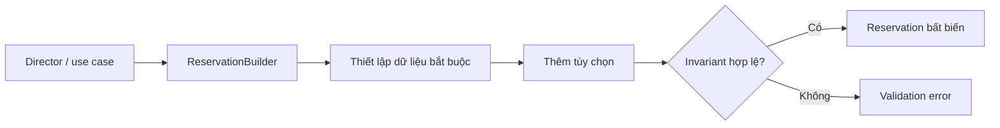

# Kata 165: Builder trong Booking

## Bối cảnh và lý do chọn bài

Module **Booking** đang hold, confirm, cancel và expire booking. Invariant bắt buộc là **không bán cùng slot quá capacity**; failure cần quan sát là **hold expiry hoặc overlap race**. Kata này dùng **Builder** để luyện cách xây object phức tạp theo bước nhưng chỉ tạo product khi invariant đầy đủ. Đây là tình huống tổng hợp phục vụ học tập, không giả định có một đề bài ẩn khác.

## Code smell cần tìm

Hãy dựng hoặc đọc starter code và đánh dấu nơi `'BookingService'` vừa điều phối use case, vừa biết concrete detail thuộc change axis của **Builder**. Dấu hiệu cần refactor không phải method dài đơn thuần, mà là mỗi lần thay đổi Booking đều buộc sửa cùng nhánh, cùng dependency hoặc cùng lifecycle logic.

## Mục tiêu thiết kế

Builder giữ construction state; `build()` validate và trả product hợp lệ. Sau refactor, client phải biết ít concrete detail hơn và invariant **không bán cùng slot quá capacity** vẫn được bảo vệ.

## Acceptance criteria

- Characterization test khóa behavior hiện tại trước khi thay cấu trúc.
- Test từ chối trường hợp vi phạm **không bán cùng slot quá capacity**.
- Failure **hold expiry hoặc overlap race** có exception/result rõ với caller, không silent fallback.
- Có scenario thứ hai chứng minh extension point của **Builder** mà không sửa orchestration ổn định.
- Test trọng tâm: required field, invalid combination, default, reuse/reset và immutability sau build.
- README lời giải nêu trade-off và điều kiện không nên dùng: object ít field hoặc named constructor đã đủ rõ.

## Hướng dẫn từng bước

1. Chạy `solution.php` hoặc starter hiện có; ghi output, exception và side effect.
2. Viết test cho happy path của **Booking**, invariant **không bán cùng slot quá capacity** và failure **hold expiry hoặc overlap race**.
3. Vẽ dependency/collaboration trước refactor; khoanh đúng change axis mà **Builder** sẽ bảo vệ.
4. Tách một responsibility mỗi lần, chạy test sau từng thay đổi; chưa đổi public API nếu chưa cần.
5. Thêm biến thể thứ hai hoặc fault injection đặc trưng cho Booking.
6. Vẽ sơ đồ sau refactor và so sánh concrete detail nào biến mất khỏi client.
7. Ghi một đoạn ngắn giải thích vì sao thiết kế trực tiếp có thể tốt hơn nếu object ít field hoặc named constructor đã đủ rõ.

## Sơ đồ mục tiêu



Sơ đồ mô tả đúng cơ chế **Builder** trong miền **Booking**. Khi triển khai, hãy giữ invariant: **không trùng lịch và không vượt capacity**. Participant trong sơ đồ là vocabulary gợi ý; đổi tên được, nhưng hướng phụ thuộc và failure boundary không được đảo ngược.

## Câu hỏi review

1. Change axis của **Builder** trong Booking có bằng chứng từ requirement hay chỉ là dự đoán?
2. Test nào sẽ thất bại nếu concrete detail quay lại `'BookingService'`?
3. Failure **hold expiry hoặc overlap race** được translate ở boundary nào?
4. Metric/log nào phát hiện vi phạm **không bán cùng slot quá capacity** trong production?
5. Chi phí type, wiring và call flow có nhỏ hơn rủi ro **object ít field hoặc named constructor đã đủ rõ** không?

## Gợi ý lời giải

Bắt đầu từ behavior contract thay vì tên participant trong sách. Với **Builder**, hãy chứng minh `required field, invalid combination, default, reuse/reset và immutability sau build` trước khi tối ưu cấu trúc. Lời giải tốt nhất là lời giải nhỏ nhất làm rõ ownership, invariant và failure semantics của Booking.

## Chạy

```bash
php kata/165-builder-booking/solution.php
```

## Tài liệu liên quan

- Bài liên quan trực tiếp: **Builder** trong **Booking**; dùng liên kết dưới đây để đối chiếu lý thuyết và bài thực hành.
- [Design Pattern overview](../../OVERVIEW.md)
- [Core pattern articles](../../docs/README.md)
- [Exercises có lời giải](../../exercises/README.md)
- [Playground](../../playground/README.md)
