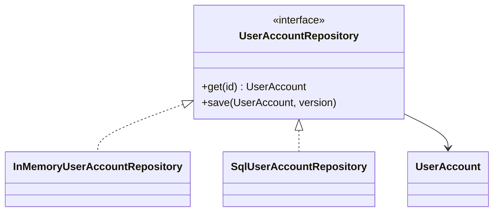

# Kata 167: Repository trong User

## Bối cảnh và lý do chọn bài

Module **User** đang đăng ký, kích hoạt và khóa tài khoản. Invariant bắt buộc là **email duy nhất và transition trạng thái hợp lệ**; failure cần quan sát là **duplicate signup hoặc activation token lỗi**. Kata này dùng **Repository** để luyện cách truy cập aggregate như collection domain và che mapping/persistence detail. Đây là tình huống tổng hợp phục vụ học tập, không giả định có một đề bài ẩn khác.

## Code smell cần tìm

Hãy dựng hoặc đọc starter code và đánh dấu nơi `'UserService'` vừa điều phối use case, vừa biết concrete detail thuộc change axis của **Repository**. Dấu hiệu cần refactor không phải method dài đơn thuần, mà là mỗi lần thay đổi User đều buộc sửa cùng nhánh, cùng dependency hoặc cùng lifecycle logic.

## Mục tiêu thiết kế

Application phụ thuộc repository port; adapter ORM/SQL implement contract theo use case. Sau refactor, client phải biết ít concrete detail hơn và invariant **email duy nhất và transition trạng thái hợp lệ** vẫn được bảo vệ.

## Acceptance criteria

- Characterization test khóa behavior hiện tại trước khi thay cấu trúc.
- Test từ chối trường hợp vi phạm **email duy nhất và transition trạng thái hợp lệ**.
- Failure **duplicate signup hoặc activation token lỗi** có exception/result rõ với caller, không silent fallback.
- Có scenario thứ hai chứng minh extension point của **Repository** mà không sửa orchestration ổn định.
- Test trọng tâm: add/find/not-found/uniqueness và parity giữa in-memory với adapter thật.
- README lời giải nêu trade-off và điều kiện không nên dùng: generic CRUD wrapper hoặc trả query builder.

## Hướng dẫn từng bước

1. Chạy `solution.php` hoặc starter hiện có; ghi output, exception và side effect.
2. Viết test cho happy path của **User**, invariant **email duy nhất và transition trạng thái hợp lệ** và failure **duplicate signup hoặc activation token lỗi**.
3. Vẽ dependency/collaboration trước refactor; khoanh đúng change axis mà **Repository** sẽ bảo vệ.
4. Tách một responsibility mỗi lần, chạy test sau từng thay đổi; chưa đổi public API nếu chưa cần.
5. Thêm biến thể thứ hai hoặc fault injection đặc trưng cho User.
6. Vẽ sơ đồ sau refactor và so sánh concrete detail nào biến mất khỏi client.
7. Ghi một đoạn ngắn giải thích vì sao thiết kế trực tiếp có thể tốt hơn nếu generic CRUD wrapper hoặc trả query builder.

## Sơ đồ mục tiêu



Sơ đồ mô tả đúng cơ chế **Repository** trong miền **User**. Khi triển khai, hãy giữ invariant: **identity và authorization nhất quán**. Participant trong sơ đồ là vocabulary gợi ý; đổi tên được, nhưng hướng phụ thuộc và failure boundary không được đảo ngược.

## Câu hỏi review

1. Change axis của **Repository** trong User có bằng chứng từ requirement hay chỉ là dự đoán?
2. Test nào sẽ thất bại nếu concrete detail quay lại `'UserService'`?
3. Failure **duplicate signup hoặc activation token lỗi** được translate ở boundary nào?
4. Metric/log nào phát hiện vi phạm **email duy nhất và transition trạng thái hợp lệ** trong production?
5. Chi phí type, wiring và call flow có nhỏ hơn rủi ro **generic CRUD wrapper hoặc trả query builder** không?

## Gợi ý lời giải

Bắt đầu từ behavior contract thay vì tên participant trong sách. Với **Repository**, hãy chứng minh `add/find/not-found/uniqueness và parity giữa in-memory với adapter thật` trước khi tối ưu cấu trúc. Lời giải tốt nhất là lời giải nhỏ nhất làm rõ ownership, invariant và failure semantics của User.

## Chạy

```bash
php kata/167-repository-user/solution.php
```

## Tài liệu liên quan

- Bài liên quan trực tiếp: **Repository** trong **User**; dùng liên kết dưới đây để đối chiếu lý thuyết và bài thực hành.
- [Design Pattern overview](../../OVERVIEW.md)
- [Core pattern articles](../../docs/README.md)
- [Exercises có lời giải](../../exercises/README.md)
- [Playground](../../playground/README.md)
