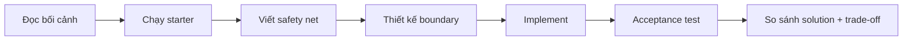
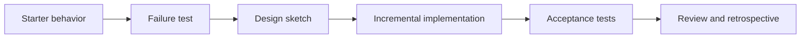

# Labs — Thực hành có hướng dẫn và kiểm chứng

Lab là bài thực hành dài hơn kata. Người học bắt đầu từ starter code, xác định behavior hiện tại, thiết kế giải pháp, chạy acceptance test và so sánh với lời giải tham khảo.



## Cách học đúng

1. **Không mở solution ngay.** Ghi lại invariant, failure path và change axis trước.
2. **Chạy starter.** Xác nhận output, lỗi hiện tại và dependency khó test.
3. **Tạo safety net.** Ưu tiên characterization test trước khi đổi cấu trúc.
4. **Vẽ thiết kế tối thiểu.** Một class diagram hoặc sequence diagram đủ để giải thích dependency direction.
5. **Refactor theo bước nhỏ.** Mỗi bước phải giữ test xanh.
6. **Đọc solution như một phương án, không phải đáp án duy nhất.** So sánh boundary, naming, failure semantics và chi phí abstraction.
7. **Viết retrospective.** Trả lời: pattern giúp thay đổi nào rẻ hơn, và complexity mới nằm ở đâu?

## Cấu trúc chuẩn của một lab

```text
<lab-name>/
├── README.md              # Bối cảnh, invariant, nhiệm vụ, gợi ý
├── starter/               # Code ban đầu
├── solution/              # Lời giải tham khảo + walkthrough
└── tests/ hoặc test.php   # Acceptance/contract test
```

## Danh mục theo cấp độ

- [`beginner/`](beginner/): nhận diện smell, tách dependency, pattern cơ bản.
- [`intermediate/`](intermediate/): workflow, integration boundary, transaction và testability.
- [`advanced/`](advanced/): idempotency, concurrency, outbox, consistency và observability.

## Tiêu chí hoàn thành

Một lab chỉ được xem là hoàn thành khi:

- Happy path và failure path quan trọng có test.
- Domain invariant không bị rò vào controller/framework layer.
- Dependency direction có thể giải thích bằng sơ đồ.
- Không tạo interface/factory chỉ để “đúng pattern”.
- Người học nêu được ít nhất một trade-off và một phương án đơn giản hơn.

## Cách tổ chức một buổi Lab

1. Chạy starter và ghi behavior hiện tại.
2. Viết failure test trước khi refactor.
3. Vẽ diagram thể hiện ownership và dependency.
4. Thực hiện thay đổi nhỏ nhất làm test pass.
5. So sánh solution tham khảo, không sao chép ngay từ đầu.
6. Viết trade-off, production gap và rollback note.



Lab đạt chuẩn khi người học có thể giải thích tại sao abstraction tồn tại và test nào cho phép xóa hoặc thay nó an toàn.
