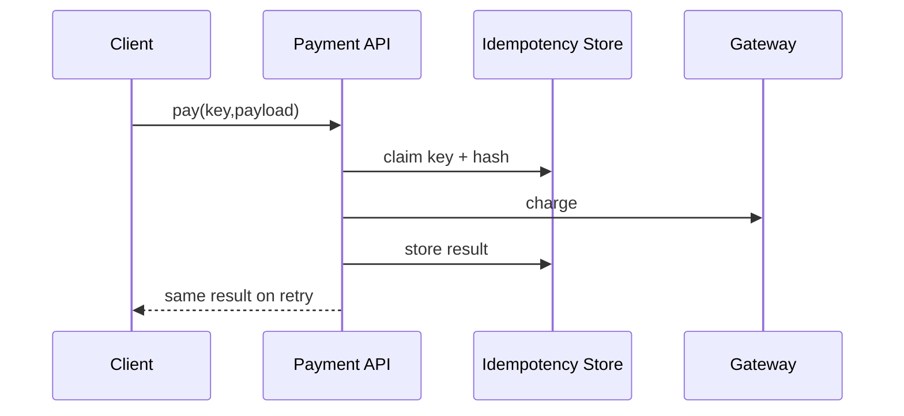

# Lab: Thanh toán idempotent

## Bối cảnh nghiệp vụ

Client có thể retry do timeout; cùng logical payment không được charge hai lần.

## Mục tiêu học tập

Lab tập trung vào **Idempotency**. Sau khi hoàn thành, bạn phải giải thích được boundary, invariant, failure path và lý do thiết kế — không chỉ làm test pass.

## Sơ đồ định hướng



## Invariant bắt buộc

- Cùng key khác payload bị reject
- Concurrent duplicate chỉ charge một lần
- Kết quả cũ được replay

## Nhiệm vụ

1. Test race condition
2. Mô hình hóa processing/completed
3. Định nghĩa expiry policy

## Cách làm gợi ý

1. Chạy acceptance test của **Thanh toán idempotent** và ghi lại output trước khi sửa code.
2. Xác định nơi đang bảo vệ `Cùng key khác payload bị reject`; nếu rule nằm ở nhiều chỗ, viết characterization test trước.
3. Tách boundary theo **Idempotency**, chỉ tạo abstraction khi nó làm failure hoặc trục thay đổi rõ hơn.
4. Thêm một test phá vỡ invariant và một test mô phỏng failure đặc trưng của `Thanh toán idempotent`.
5. Chạy solution sau cùng, so sánh dependency direction và giải thích khác biệt bằng trade-off.
## Chạy bài

```bash
php labs/advanced/04-idempotent-payment/tests/acceptance.php
php labs/advanced/04-idempotent-payment/solution/main.php
```

## Tiêu chí review

- Solution bảo vệ rõ invariant: **Cùng key khác payload bị reject**.
- Contract của **Idempotency** dùng vocabulary của `Thanh toán idempotent`, không dùng tên chung như `Manager` hoặc `Handler` thiếu ngữ nghĩa.
- Failure path của `Thanh toán idempotent` được biểu diễn bằng exception/result có reason cụ thể.
- Test chứng minh behavior và boundary, không khóa chặt thứ tự gọi nội bộ không cần thiết.
- Phần ghi chú nêu được một tình huống mà giải pháp trực tiếp sẽ dễ bảo trì hơn.

## Lời giải định hướng

Mô hình trung tâm là **PaymentIntent và IdempotencyRecord**. Hướng triển khai nên bắt đầu từ invariant và state transition, không bắt đầu bằng việc tạo interface theo tên pattern.

1. claim key bằng unique constraint; lưu payload hash; chỉ một worker được chuyển processing→completed.
2. Viết characterization test cho baseline, sau đó thêm contract test cho boundary mới.
3. Mô phỏng failure: timeout sau provider success phải chuyển sang reconciliation, không charge lại. Test phải kiểm tra state cuối và side effect, không chỉ exception.
4. Ghi lại telemetry tối thiểu: idempotency conflict rate, processing age và reconciliation backlog.
5. So sánh với giải pháp trực tiếp; chỉ giữ abstraction khi nó làm client biết ít chi tiết hơn hoặc cô lập failure tốt hơn.

### Kết quả mong đợi

- gateway fake chỉ ghi một charge cho concurrent duplicates.
- retry trả cùng payment result và payload conflict bị reject.
- reconciliation record tồn tại khi outcome ambiguous.

Chỉ mở [`solution/`](solution/) sau khi bạn đã lưu diagram, test đỏ đầu tiên và giải thích trade-off của bài **04 idempotent payment**.
