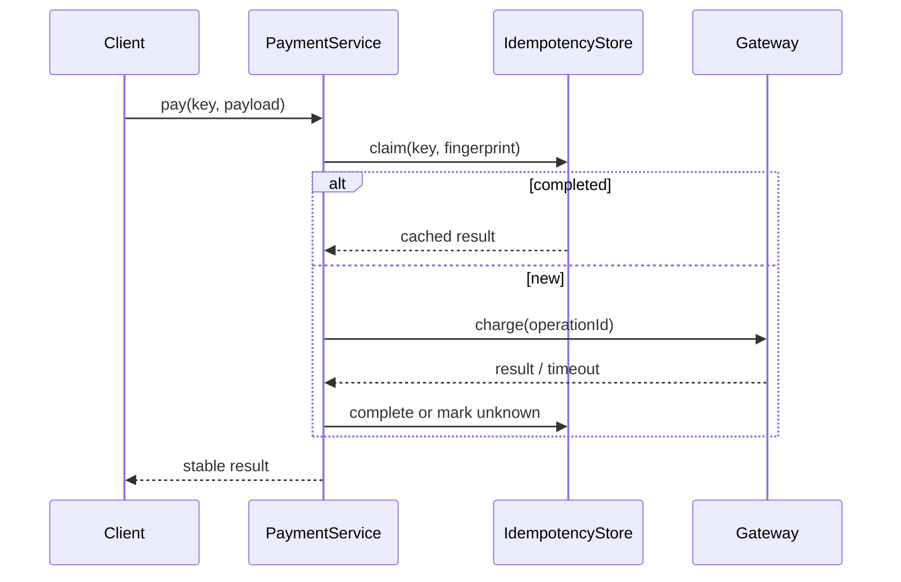

# Lời giải: Idempotent Payment

## Kết luận thiết kế

Bài giải sử dụng **Idempotency + Payment Orchestration** để giải quyết đúng change axis của lab. Lưu idempotency record theo key trước/đồng thời với xử lý, gắn fingerprint payload và kết quả. Cùng key/cùng payload trả lại kết quả; cùng key/khác payload bị từ chối. Unknown provider result đi vào reconciliation thay vì retry mù.

## Mô hình lời giải

## Invariant phải giữ

Một key không đại diện hai payload; side effect provider tối đa một logical payment; unknown không bị báo failed sai.

## Trình tự triển khai

1. Định nghĩa lifecycle idempotency record: claimed, completed, unknown, failed.
2. Tính payload fingerprint canonical.
3. Thực hiện atomic claim theo key.
4. Gọi provider với operation ID và lưu result/unknown.
5. Kiểm tra concurrent replay, conflict và reconciliation.

## Kiểm thử bắt buộc

Concurrent claim test; payload conflict; timeout-after-success; replay; reconciliation transition.

## Trade-off

Idempotency giảm duplicate side effect nhưng cần storage/lifecycle/recovery. TTL quá ngắn hoặc fingerprint không canonical có thể phá guarantee; record trở thành production state phải quan sát.

## Production hardening

- Unique constraint trên key và lưu fingerprint/result.
- Metric replay, conflict, unknown và stuck claim.
- Reconciliation cho timeout sau success.
- Retention theo thời gian retry tối đa của client/provider.

## Khi không nên áp dụng

Không cần idempotency store nếu operation thuần, không có side effect và caller không retry.

## Câu hỏi review

- Scope key theo merchant/user/operation thế nào?
- Hai payload semantically giống nhưng JSON khác canonical hóa ra sao?
- Process crash sau provider success để record ở trạng thái nào?
- Khi nào client được phép dùng key mới?

## Review lời giải bằng evidence

Với **Idempotent Payment**, reviewer phải lần theo một scenario từ input đến state/side effect cuối, đối chiếu với invariant: **Một key không đại diện hai payload; side effect provider tối đa một logical payment; unknown không bị báo failed sai.**. Không chấp nhận lời giải chỉ tăng số class nhưng không tạo test tái hiện failure hoặc không làm rõ ownership.

### Checklist cuối

- Key gắn fingerprint payload.
- Success-then-timeout có reconciliation.
- Concurrent duplicate không charge hai lần.
