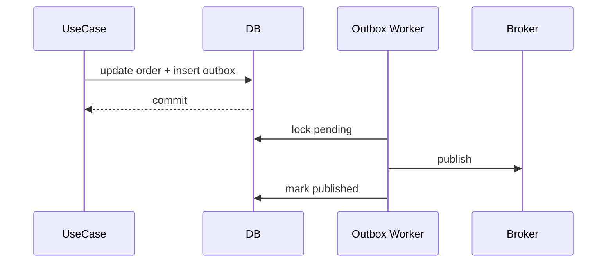

# Lab: Transactional Outbox

## Bối cảnh nghiệp vụ

Order update và integration event phải commit cùng nhau dù broker tạm thời lỗi.

## Mục tiêu học tập

Lab tập trung vào **Outbox**. Sau khi hoàn thành, bạn phải giải thích được boundary, invariant, failure path và lý do thiết kế — không chỉ làm test pass.

## Sơ đồ định hướng



## Invariant bắt buộc

- Không mất event sau commit
- Publish duplicate được chấp nhận
- Worker có retry/dead-letter

## Nhiệm vụ

1. Mô phỏng crash sau publish
2. Thêm stable event ID
3. Thiết kế cleanup/retention

## Cách làm gợi ý

1. Chạy acceptance test của **Transactional Outbox** và ghi lại output trước khi sửa code.
2. Xác định nơi đang bảo vệ `Không mất event sau commit`; nếu rule nằm ở nhiều chỗ, viết characterization test trước.
3. Tách boundary theo **Outbox**, chỉ tạo abstraction khi nó làm failure hoặc trục thay đổi rõ hơn.
4. Thêm một test phá vỡ invariant và một test mô phỏng failure đặc trưng của `Transactional Outbox`.
5. Chạy solution sau cùng, so sánh dependency direction và giải thích khác biệt bằng trade-off.
## Chạy bài

```bash
php labs/advanced/05-transactional-outbox/tests/acceptance.php
php labs/advanced/05-transactional-outbox/solution/main.php
```

## Tiêu chí review

- Solution bảo vệ rõ invariant: **Không mất event sau commit**.
- Contract của **Outbox** dùng vocabulary của `Transactional Outbox`, không dùng tên chung như `Manager` hoặc `Handler` thiếu ngữ nghĩa.
- Failure path của `Transactional Outbox` được biểu diễn bằng exception/result có reason cụ thể.
- Test chứng minh behavior và boundary, không khóa chặt thứ tự gọi nội bộ không cần thiết.
- Phần ghi chú nêu được một tình huống mà giải pháp trực tiếp sẽ dễ bảo trì hơn.

## Kịch bản lỗi cần mô phỏng

Sau khi transaction commit, publisher gửi message rồi crash trước khi cập nhật trạng thái. Lab phải chứng minh lần chạy sau có thể gửi lại mà consumer không tạo side effect lần hai. Thêm metric `oldest_pending_age` và một lệnh replay có giới hạn theo event id/time window để tránh flood broker.

## Lời giải định hướng

Mô hình trung tâm là **Aggregate và OutboxMessage**. Hướng triển khai nên bắt đầu từ invariant và state transition, không bắt đầu bằng việc tạo interface theo tên pattern.

1. ghi state + outbox trong một transaction; publisher dùng lease và mark-published idempotent.
2. Viết characterization test cho baseline, sau đó thêm contract test cho boundary mới.
3. Mô phỏng failure: crash sau publish trước mark tạo duplicate delivery. Test phải kiểm tra state cuối và side effect, không chỉ exception.
4. Ghi lại telemetry tối thiểu: outbox age, publish attempts và dead-letter age.
5. So sánh với giải pháp trực tiếp; chỉ giữ abstraction khi nó làm client biết ít chi tiết hơn hoặc cô lập failure tốt hơn.

### Kết quả mong đợi

- aggregate state và outbox row commit cùng nhau.
- publisher retry tạo duplicate delivery nhưng consumer side effect chỉ một lần.
- oldest pending age được quan sát.

Chỉ mở [`solution/`](solution/) sau khi bạn đã lưu diagram, test đỏ đầu tiên và giải thích trade-off của bài **05 transactional outbox**.
