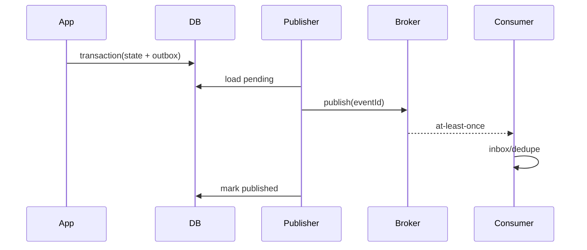

# Lời giải: Transactional Outbox

## Kết luận thiết kế

Bài giải sử dụng **Outbox** để giải quyết đúng change axis của lab. Ghi aggregate state và outbox message trong cùng transaction. Publisher đọc pending, publish và mark; consumer phải idempotent vì crash sau broker ack có thể tạo duplicate.

## Mô hình lời giải

## Invariant phải giữ

Không có state commit mà thiếu event record; duplicate delivery không lặp business effect; backlog có thể recover.

## Trình tự triển khai

1. Thêm bảng outbox vào cùng database với aggregate.
2. Ghi state và event trong một transaction.
3. Tạo publisher claim batch có lease.
4. Publish rồi mark, chấp nhận duplicate.
5. Thêm consumer inbox và chạy crash matrix.

## Kiểm thử bắt buộc

Rollback atomicity; crash matrix trước/sau publish/mark; consumer dedupe; ordering/version test.

## Trade-off

Outbox giải quyết dual-write nhưng không tạo exactly-once end-to-end. Nó thêm backlog, cleanup, ordering và duplicate handling; vận hành publisher/consumer là phần của thiết kế.

## Production hardening

- Alert oldest pending age và publish failure rate.
- Lease/skip-locked cho nhiều publisher.
- Event ID/version/occurred-at bắt buộc.
- Archive/retention và replay tooling.

## Khi không nên áp dụng

Không cần Outbox cho side effect đồng bộ trong cùng database transaction hoặc event không cần độ tin cậy.

## Câu hỏi review

- Transaction nào chứa state và outbox?
- Crash sau broker ack trước mark tạo gì?
- Ordering theo aggregate được bảo đảm đến mức nào?
- Consumer dùng inbox hay natural idempotency?

## Review lời giải bằng evidence

Với **Transactional Outbox**, reviewer phải lần theo một scenario từ input đến state/side effect cuối, đối chiếu với invariant: **Không có state commit mà thiếu event record; duplicate delivery không lặp business effect; backlog có thể recover.**. Không chấp nhận lời giải chỉ tăng số class nhưng không tạo test tái hiện failure hoặc không làm rõ ownership.

### Checklist cuối

- State và outbox commit cùng transaction.
- Publisher duplicate-safe.
- Backlog/poison message có metric.

## Failure walkthrough: publisher crash sau broker acknowledgement

Publisher có thể crash sau khi broker nhận event nhưng trước khi đánh dấu `published_at`. Lần quét sau sẽ publish lại; vì vậy consumer phải có inbox/deduplication và handler idempotent. Không được “sửa” bằng cách đánh dấu published trước khi broker ack vì sẽ tạo nguy cơ mất event.

## Evidence cần lưu khi review

- Integration test với database transaction thật cho state + outbox row.
- Crash test giữa publish và mark-published.
- Metric pending age, publish attempts và consumer duplicate rate.
- Runbook replay theo batch có rate limit và correlation ID.
