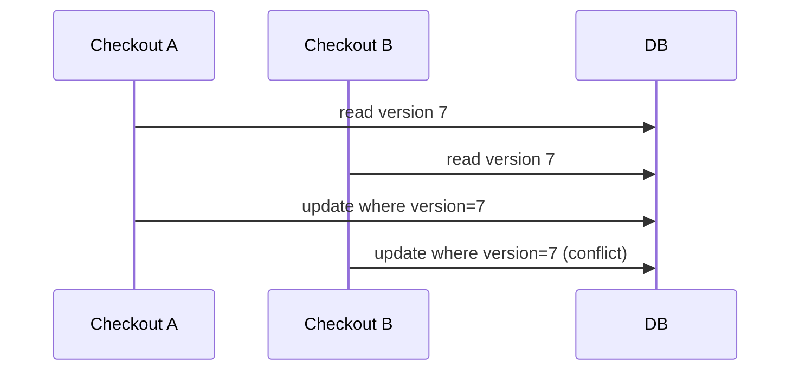

# Lab: Concurrency trong Inventory

## Bối cảnh nghiệp vụ

Hai checkout cùng reserve SKU cuối cùng có thể gây oversell.

## Mục tiêu học tập

Lab tập trung vào **Optimistic/Pessimistic Locking**. Sau khi hoàn thành, bạn phải giải thích được boundary, invariant, failure path và lý do thiết kế — không chỉ làm test pass.

## Sơ đồ định hướng



## Invariant bắt buộc

- Available không âm
- Reservation có TTL
- Conflict trả lỗi/retry rõ

## Nhiệm vụ

1. Thêm version check
2. Test concurrent attempt
3. So sánh optimistic với row lock

## Cách làm gợi ý

1. Chạy acceptance test của **Concurrency trong Inventory** và ghi lại output trước khi sửa code.
2. Xác định nơi đang bảo vệ `Available không âm`; nếu rule nằm ở nhiều chỗ, viết characterization test trước.
3. Tách boundary theo **Optimistic/Pessimistic Locking**, chỉ tạo abstraction khi nó làm failure hoặc trục thay đổi rõ hơn.
4. Thêm một test phá vỡ invariant và một test mô phỏng failure đặc trưng của `Concurrency trong Inventory`.
5. Chạy solution sau cùng, so sánh dependency direction và giải thích khác biệt bằng trade-off.
## Chạy bài

```bash
php labs/advanced/06-inventory-concurrency/tests/acceptance.php
php labs/advanced/06-inventory-concurrency/solution/main.php
```

## Tiêu chí review

- Solution bảo vệ rõ invariant: **Available không âm**.
- Contract của **Optimistic/Pessimistic Locking** dùng vocabulary của `Concurrency trong Inventory`, không dùng tên chung như `Manager` hoặc `Handler` thiếu ngữ nghĩa.
- Failure path của `Concurrency trong Inventory` được biểu diễn bằng exception/result có reason cụ thể.
- Test chứng minh behavior và boundary, không khóa chặt thứ tự gọi nội bộ không cần thiết.
- Phần ghi chú nêu được một tình huống mà giải pháp trực tiếp sẽ dễ bảo trì hơn.

## Mô phỏng cạnh tranh thực tế

Khởi tạo hai command cùng đọc một version tồn kho rồi cố reserve số lượng vượt available khi cộng lại. Một command phải thắng, command còn lại nhận conflict rõ ràng và có thể reload. Test không được chạy tuần tự giả lập; dùng transaction/integration boundary đủ gần database semantics để phát hiện lost update.

## Lời giải định hướng

Mô hình trung tâm là **StockLedger và Reservation**. Hướng triển khai nên bắt đầu từ invariant và state transition, không bắt đầu bằng việc tạo interface theo tên pattern.

1. conditional write theo version hoặc atomic counter; reservation có operation id.
2. Viết characterization test cho baseline, sau đó thêm contract test cho boundary mới.
3. Mô phỏng failure: hai checkout cùng đọc available giống nhau. Test phải kiểm tra state cuối và side effect, không chỉ exception.
4. Ghi lại telemetry tối thiểu: conflict rate, negative ATP và stale reservation.
5. So sánh với giải pháp trực tiếp; chỉ giữ abstraction khi nó làm client biết ít chi tiết hơn hoặc cô lập failure tốt hơn.

### Kết quả mong đợi

- hai worker không thể làm ATP âm.
- stale version bị conflict thay vì ghi đè.
- expired reservation được release có operation id.

Chỉ mở [`solution/`](solution/) sau khi bạn đã lưu diagram, test đỏ đầu tiên và giải thích trade-off của bài **06 inventory concurrency**.
