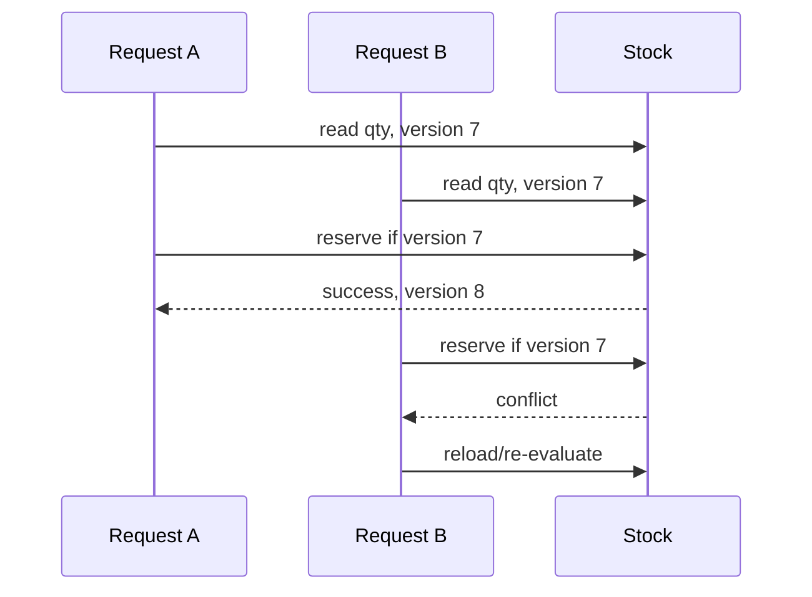

# Lời giải: Inventory Concurrency

## Kết luận thiết kế

Bài giải sử dụng **Optimistic Concurrency + Reservation** để giải quyết đúng change axis của lab. Reservation dùng version/conditional write trên stock position. Đọc–tính–ghi phải thất bại rõ khi version stale; caller retry từ state mới thay vì ghi đè.

## Mô hình lời giải

## Invariant phải giữ

Available không âm; reserved + available bảo toàn quantity; conflict không biến thành generic 500.

## Trình tự triển khai

1. Viết conservation invariant và race test hai writer.
2. Thêm version vào stock position.
3. Dùng conditional update/reservation command.
4. Trả domain conflict, reload và re-evaluate.
5. Thêm expiry/release và reconciliation.

## Kiểm thử bắt buộc

Two-writer race; retry budget; release/expiry; conservation property test; stale command.

## Trade-off

Optimistic concurrency tránh lock dài nhưng dưới contention cao có thể tạo retry storm. Business rule phải được đánh giá lại sau reload; không tự động retry command đã có side effect ngoài DB.

## Production hardening

- Metric conflict/retry/negative-availability.
- Retry budget + jitter và fallback queue nếu contention cao.
- Reservation TTL dùng clock thống nhất.
- Reconcile ledger với projection/physical count.

## Khi không nên áp dụng

Pessimistic lock có thể phù hợp hơn khi contention cao và transaction rất ngắn; single-thread batch không cần concurrency abstraction.

## Câu hỏi review

- Version nằm ở SKU-location hay aggregate nào?
- Retry có dùng state mới để kiểm tra quantity không?
- Release và reserve đồng thời xử lý ra sao?
- Khi nào chuyển sang pessimistic/serialized processing?

## Review lời giải bằng evidence

Với **Inventory Concurrency**, reviewer phải lần theo một scenario từ input đến state/side effect cuối, đối chiếu với invariant: **Available không âm; reserved + available bảo toàn quantity; conflict không biến thành generic 500.**. Không chấp nhận lời giải chỉ tăng số class nhưng không tạo test tái hiện failure hoặc không làm rõ ownership.

### Checklist cuối

- Hai writer đồng thời được tái hiện.
- Version conflict không bị retry vô hạn.
- Conservation invariant được kiểm chứng.
