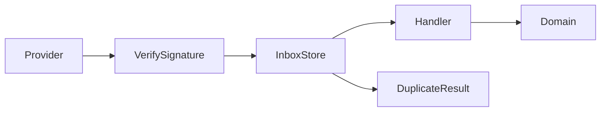

# Lab: Webhook Inbox

## Bối cảnh nghiệp vụ

Provider retry webhook, gửi sai thứ tự và có thể ký payload không hợp lệ.

## Mục tiêu học tập

Lab tập trung vào **Inbox/Idempotent Consumer**. Sau khi hoàn thành, bạn phải giải thích được boundary, invariant, failure path và lý do thiết kế — không chỉ làm test pass.

## Sơ đồ định hướng



## Invariant bắt buộc

- Verify raw body trước parse
- Event ID unique
- Handler idempotent và retryable

## Nhiệm vụ

1. Test duplicate/out-of-order
2. Thêm quarantine cho signature fail
3. Thiết kế replay tool

## Cách làm gợi ý

1. Chạy acceptance test của **Webhook Inbox** và ghi lại output trước khi sửa code.
2. Xác định nơi đang bảo vệ `Verify raw body trước parse`; nếu rule nằm ở nhiều chỗ, viết characterization test trước.
3. Tách boundary theo **Inbox/Idempotent Consumer**, chỉ tạo abstraction khi nó làm failure hoặc trục thay đổi rõ hơn.
4. Thêm một test phá vỡ invariant và một test mô phỏng failure đặc trưng của `Webhook Inbox`.
5. Chạy solution sau cùng, so sánh dependency direction và giải thích khác biệt bằng trade-off.
## Chạy bài

```bash
php labs/advanced/07-webhook-inbox/tests/acceptance.php
php labs/advanced/07-webhook-inbox/solution/main.php
```

## Tiêu chí review

- Solution bảo vệ rõ invariant: **Verify raw body trước parse**.
- Contract của **Inbox/Idempotent Consumer** dùng vocabulary của `Webhook Inbox`, không dùng tên chung như `Manager` hoặc `Handler` thiếu ngữ nghĩa.
- Failure path của `Webhook Inbox` được biểu diễn bằng exception/result có reason cụ thể.
- Test chứng minh behavior và boundary, không khóa chặt thứ tự gọi nội bộ không cần thiết.
- Phần ghi chú nêu được một tình huống mà giải pháp trực tiếp sẽ dễ bảo trì hơn.

## Lời giải định hướng

Mô hình trung tâm là **WebhookInbox và ProviderEvent**. Hướng triển khai nên bắt đầu từ invariant và state transition, không bắt đầu bằng việc tạo interface theo tên pattern.

1. verify signature trước persistence; dedup theo provider event id; handler retry độc lập.
2. Viết characterization test cho baseline, sau đó thêm contract test cho boundary mới.
3. Mô phỏng failure: provider gửi duplicate hoặc out-of-order event. Test phải kiểm tra state cuối và side effect, không chỉ exception.
4. Ghi lại telemetry tối thiểu: inbox lag, duplicate rate và poison event age.
5. So sánh với giải pháp trực tiếp; chỉ giữ abstraction khi nó làm client biết ít chi tiết hơn hoặc cô lập failure tốt hơn.

### Kết quả mong đợi

- signature invalid không vào inbox.
- duplicate provider event không chạy handler lần hai.
- out-of-order event được defer hoặc reason-code.

Chỉ mở [`solution/`](solution/) sau khi bạn đã lưu diagram, test đỏ đầu tiên và giải thích trade-off của bài **07 webhook inbox**.
