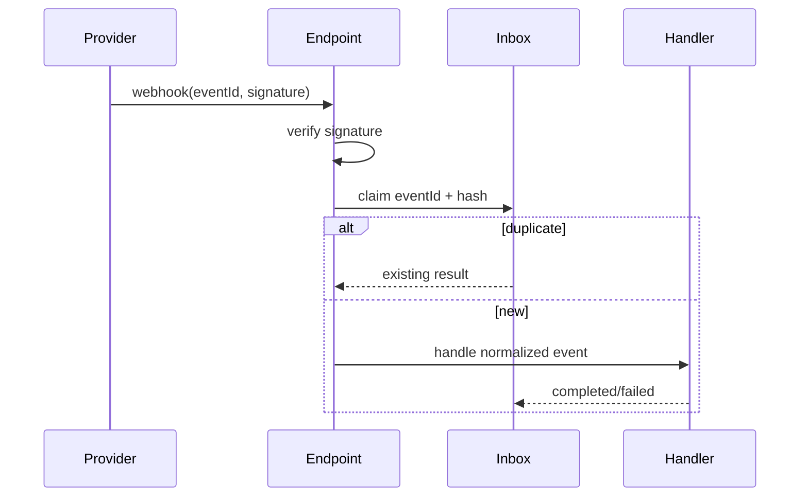

# Lời giải: Webhook Inbox

## Kết luận thiết kế

Bài giải sử dụng **Inbox + Idempotent Consumer** để giải quyết đúng change axis của lab. Xác thực signature trước, lưu event ID/payload hash vào inbox rồi xử lý theo trạng thái. Duplicate trả kết quả ổn định; out-of-order event được so version hoặc timestamp nghiệp vụ.

## Mô hình lời giải

## Invariant phải giữ

Invalid signature không ghi inbox; same ID/different payload bị cảnh báo; duplicate không lặp side effect.

## Trình tự triển khai

1. Verify signature/timestamp trước parse business payload.
2. Normalize provider event và tính payload hash.
3. Atomic claim event ID trong inbox.
4. Handle và lưu result/error/state.
5. Test duplicate concurrent, out-of-order và resume sau crash.

## Kiểm thử bắt buộc

Signature/replay tests; concurrent duplicate; out-of-order; handler crash/resume; poison event/dead-letter.

## Trade-off

Inbox tạo audit/replay/dedupe nhưng giữ dữ liệu nhạy cảm và cần retention. Không đánh dấu completed trước side effect bền vững; poison event cần dead-letter/manual workflow.

## Production hardening

- Rate limit và replay-window chống attack.
- Encrypt/redact raw payload.
- Metric duplicate, signature failure, processing lag.
- Tool replay theo event ID với audit actor.

## Khi không nên áp dụng

Nếu provider bảo đảm exactly-once (hiếm) và handler thuần không side effect, inbox có thể không cần.

## Câu hỏi review

- Provider có tái dùng event ID không?
- Same ID/different hash xử lý như security incident?
- Ordering được xác định bằng sequence hay business version?
- Handler crash ở giữa có resume an toàn không?

## Review lời giải bằng evidence

Với **Webhook Inbox**, reviewer phải lần theo một scenario từ input đến state/side effect cuối, đối chiếu với invariant: **Invalid signature không ghi inbox; same ID/different payload bị cảnh báo; duplicate không lặp side effect.**. Không chấp nhận lời giải chỉ tăng số class nhưng không tạo test tái hiện failure hoặc không làm rõ ownership.

### Checklist cuối

- Signature được verify trước dedup.
- Delivery id replay trả kết quả an toàn.
- Unknown event version được quarantine.
