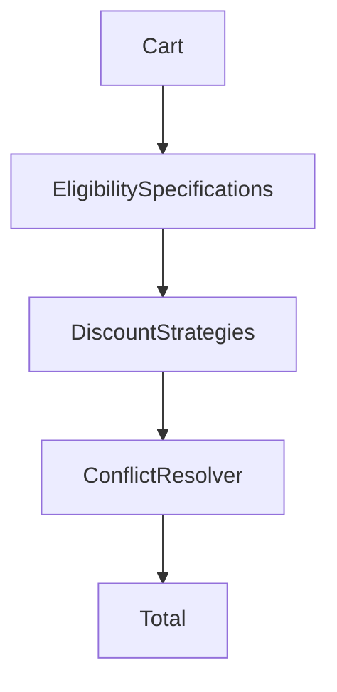

# Lab: Discount Engine

## Bối cảnh nghiệp vụ

Promotion có rule eligibility, priority và khả năng stack khác nhau.

## Mục tiêu học tập

Lab tập trung vào **Specification + Strategy**. Sau khi hoàn thành, bạn phải giải thích được boundary, invariant, failure path và lý do thiết kế — không chỉ làm test pass.

## Sơ đồ định hướng



## Invariant bắt buộc

- Total không âm
- Rule có version/effective period
- Stacking deterministic

## Nhiệm vụ

1. Thêm coupon excluded category
2. Test conflict hai promotion
3. Giải thích audit decision

## Cách làm gợi ý

1. Chạy acceptance test của **Discount Engine** và ghi lại output trước khi sửa code.
2. Xác định nơi đang bảo vệ `Total không âm`; nếu rule nằm ở nhiều chỗ, viết characterization test trước.
3. Tách boundary theo **Specification + Strategy**, chỉ tạo abstraction khi nó làm failure hoặc trục thay đổi rõ hơn.
4. Thêm một test phá vỡ invariant và một test mô phỏng failure đặc trưng của `Discount Engine`.
5. Chạy solution sau cùng, so sánh dependency direction và giải thích khác biệt bằng trade-off.
## Chạy bài

```bash
php labs/advanced/discount-engine/tests/acceptance.php
php labs/advanced/discount-engine/solution/main.php
```

## Tiêu chí review

- Solution bảo vệ rõ invariant: **Total không âm**.
- Contract của **Specification + Strategy** dùng vocabulary của `Discount Engine`, không dùng tên chung như `Manager` hoặc `Handler` thiếu ngữ nghĩa.
- Failure path của `Discount Engine` được biểu diễn bằng exception/result có reason cụ thể.
- Test chứng minh behavior và boundary, không khóa chặt thứ tự gọi nội bộ không cần thiết.
- Phần ghi chú nêu được một tình huống mà giải pháp trực tiếp sẽ dễ bảo trì hơn.

## Yêu cầu giải thích quyết định

Engine không chỉ trả số tiền giảm; phải trả rule id, reason code và intermediate calculation để support điều tra. Test cần bao boundary value, stacking order, maximum cap và rule hết hiệu lực. Khi rule do business cấu hình, validate cấu hình trước khi activate và version policy để tái tạo invoice cũ.

## Lời giải định hướng

Mô hình trung tâm là **DiscountPolicy và EligibilitySpecification**. Hướng triển khai nên bắt đầu từ invariant và state transition, không bắt đầu bằng việc tạo interface theo tên pattern.

1. tách eligibility khỏi calculation; trả reason code và money-safe result.
2. Viết characterization test cho baseline, sau đó thêm contract test cho boundary mới.
3. Mô phỏng failure: hai rule cộng dồn vượt policy cap. Test phải kiểm tra state cuối và side effect, không chỉ exception.
4. Ghi lại telemetry tối thiểu: discount leakage, rejected reason distribution và policy version.
5. So sánh với giải pháp trực tiếp; chỉ giữ abstraction khi nó làm client biết ít chi tiết hơn hoặc cô lập failure tốt hơn.

### Kết quả mong đợi

- money arithmetic không dùng float.
- eligibility trả reason code.
- policy cap và stacking rule được property-test.

Chỉ mở [`solution/`](solution/) sau khi bạn đã lưu diagram, test đỏ đầu tiên và giải thích trade-off của bài **discount engine**.
