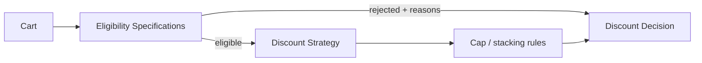

# Lời giải: Discount Engine

## Kết luận thiết kế

Bài giải sử dụng **Specification + Strategy** để giải quyết đúng change axis của lab. Eligibility rule được biểu diễn bằng Specification có reason code; cách tính discount là Strategy. Engine tách “có đủ điều kiện?” khỏi “giảm bao nhiêu?” và kiểm soát stacking/order.

## Mô hình lời giải

## Invariant phải giữ

Tổng giảm không âm và không vượt subtotal/cap; rule composition giữ reason; cùng promotion version cho kết quả xác định.

## Trình tự triển khai

1. Liệt kê eligibility rules và calculation policies riêng.
2. Tạo truth table/golden scenarios.
3. Cài Specification có reason code.
4. Cài Strategy tính amount và cap/stack coordinator.
5. Version promotion và chạy property tests.

## Kiểm thử bắt buộc

Truth-table/property tests; stacking order; boundary amount/date; conflicting promotions; explanation snapshot.

## Trade-off

Rule objects tăng khả năng giải thích/composition nhưng có thể tạo graph phức tạp và order khó thấy. Engine phải công bố stacking semantics, rounding và snapshot version.

## Production hardening

- Dùng Money và rounding rule thống nhất.
- Metric rejection reason, discount spend và anomaly.
- Version rule/policy cho audit.
- Shadow-evaluate campaign mới trước activate.

## Khi không nên áp dụng

Các phép giảm đơn giản, ít rule và không cần reuse/explanation có thể dùng function/predicate trực tiếp.

## Câu hỏi review

- Eligibility và calculation có bị trộn không?
- Rule order ảnh hưởng kết quả thế nào?
- Hai discount stack/cap theo quy tắc nào?
- Có thể giải thích decision cho support/audit không?

## Review lời giải bằng evidence

Với **Discount Engine**, reviewer phải lần theo một scenario từ input đến state/side effect cuối, đối chiếu với invariant: **Tổng giảm không âm và không vượt subtotal/cap; rule composition giữ reason; cùng promotion version cho kết quả xác định.**. Không chấp nhận lời giải chỉ tăng số class nhưng không tạo test tái hiện failure hoặc không làm rõ ownership.

### Checklist cuối

- Rule trả reason code, không chỉ boolean.
- Combination order được test.
- Money/rounding giữ invariant.

## Failure walkthrough: rule conflict và thay đổi giữa phiên checkout

Mỗi evaluation dùng `ruleSetVersion`; kết quả lưu applied rule, reason code và input snapshot tối thiểu. Khi hai rule không thể cộng dồn, conflict policy quyết định priority hoặc exclusive group. Không đọc “rule hiện tại” lần hai ở bước payment vì có thể tạo giá khác với bước review order.

## Evidence cần lưu khi review

- Property test bảo đảm discount không âm và không vượt subtotal.
- Golden test cho priority/exclusive rule.
- Metric conflict count và revenue delta theo rule version.
- Rollback bằng cách ngừng chọn version mới, không sửa lịch sử order đã chốt.
