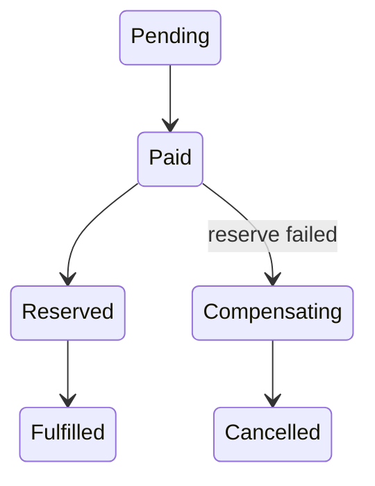

# Lab: Order Workflow

## Bối cảnh nghiệp vụ

Order orchestration gồm payment, inventory và fulfillment với compensation khi một bước thất bại.

## Mục tiêu học tập

Lab tập trung vào **Saga/State**. Sau khi hoàn thành, bạn phải giải thích được boundary, invariant, failure path và lý do thiết kế — không chỉ làm test pass.

## Sơ đồ định hướng



## Invariant bắt buộc

- Command idempotent
- Compensation có owner
- State transition audit được

## Nhiệm vụ

1. Mô phỏng timeout không rõ kết quả
2. Thêm reconciliation
3. Test duplicate event

## Cách làm gợi ý

1. Chạy acceptance test của **Order Workflow** và ghi lại output trước khi sửa code.
2. Xác định nơi đang bảo vệ `Command idempotent`; nếu rule nằm ở nhiều chỗ, viết characterization test trước.
3. Tách boundary theo **Saga/State**, chỉ tạo abstraction khi nó làm failure hoặc trục thay đổi rõ hơn.
4. Thêm một test phá vỡ invariant và một test mô phỏng failure đặc trưng của `Order Workflow`.
5. Chạy solution sau cùng, so sánh dependency direction và giải thích khác biệt bằng trade-off.
## Chạy bài

```bash
php labs/advanced/order-workflow/tests/acceptance.php
php labs/advanced/order-workflow/solution/main.php
```

## Tiêu chí review

- Solution bảo vệ rõ invariant: **Command idempotent**.
- Contract của **Saga/State** dùng vocabulary của `Order Workflow`, không dùng tên chung như `Manager` hoặc `Handler` thiếu ngữ nghĩa.
- Failure path của `Order Workflow` được biểu diễn bằng exception/result có reason cụ thể.
- Test chứng minh behavior và boundary, không khóa chặt thứ tự gọi nội bộ không cần thiết.
- Phần ghi chú nêu được một tình huống mà giải pháp trực tiếp sẽ dễ bảo trì hơn.

## Workflow và recovery

Thiết kế phải lưu state của process manager trước khi gửi command tiếp theo. Timeout cần tạo action có idempotency và correlation id. Với compensation thất bại, workflow chuyển sang trạng thái cần can thiệp thay vì retry vô hạn. Lab hoàn thành khi có thể replay event và giải thích vì sao order không bị tiến hai lần.

## Lời giải định hướng

Mô hình trung tâm là **OrderState và ProcessManager**. Hướng triển khai nên bắt đầu từ invariant và state transition, không bắt đầu bằng việc tạo interface theo tên pattern.

1. persist workflow state; command idempotent; timeout tạo explicit transition.
2. Viết characterization test cho baseline, sau đó thêm contract test cho boundary mới.
3. Mô phỏng failure: payment success đến sau cancellation. Test phải kiểm tra state cuối và side effect, không chỉ exception.
4. Ghi lại telemetry tối thiểu: stuck state age, compensation failure và transition rejection.
5. So sánh với giải pháp trực tiếp; chỉ giữ abstraction khi nó làm client biết ít chi tiết hơn hoặc cô lập failure tốt hơn.

### Kết quả mong đợi

- transition table reject late/illegal event.
- command duplicate không phát side effect mới.
- timeout/compensation tạo state quan sát được.

Chỉ mở [`solution/`](solution/) sau khi bạn đã lưu diagram, test đỏ đầu tiên và giải thích trade-off của bài **order workflow**.
