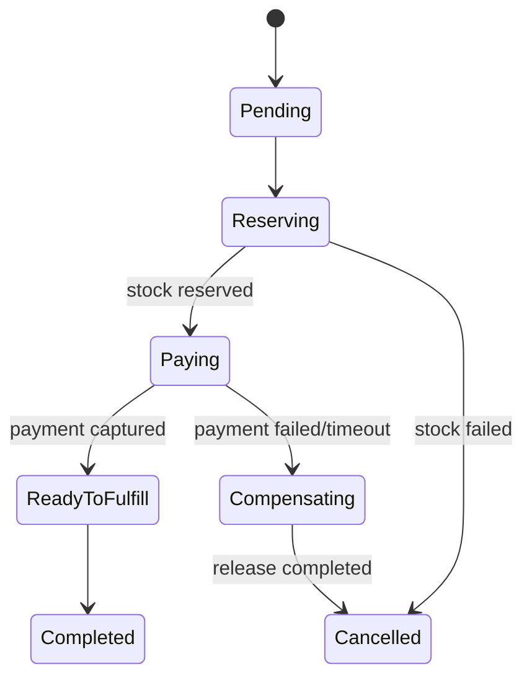

# Lời giải: Order Workflow

## Kết luận thiết kế

Bài giải sử dụng **State + Process Manager** để giải quyết đúng change axis của lab. Order giữ lifecycle/invariant cục bộ; Process Manager điều phối payment, inventory và fulfillment qua command/event, lưu state để resume và compensation.

## Mô hình lời giải

## Invariant phải giữ

Transition hợp lệ, command idempotent, compensation có owner, workflow có thể resume sau crash.

## Trình tự triển khai

1. Vẽ state machine và external commands/events.
2. Tách invariant cục bộ vào Order.
3. Tạo Process Manager lưu tiến trình.
4. Làm command/consumer idempotent và thêm timeout.
5. Mô phỏng compensation failure và manual recovery.

## Kiểm thử bắt buộc

State transition tests; duplicate/out-of-order events; timeout; compensation failure; reconciliation/manual intervention.

## Trade-off

Process Manager làm workflow dài recoverable nhưng thêm state machine phân tán, duplicate/out-of-order handling và reconciliation. Không dùng nếu một transaction đồng bộ đã giải quyết được.

## Production hardening

- Dashboard stuck workflow theo state/age.
- Correlation/causation ID xuyên command/event.
- Retry/timeout/compensation policy versioned.
- Runbook resume, compensate hoặc mark manual.

## Khi không nên áp dụng

Một transaction script đồng bộ phù hợp hơn nếu tất cả bước trong một database và không có long-running side effect.

## Câu hỏi review

- Aggregate nào sở hữu invariant nào?
- Compensation có thực sự hoàn tác được không?
- Event out-of-order được buffer/reject thế nào?
- Khi workflow code đổi, instance đang chạy migrate ra sao?

## Review lời giải bằng evidence

Với **Order Workflow**, reviewer phải lần theo một scenario từ input đến state/side effect cuối, đối chiếu với invariant: **Transition hợp lệ, command idempotent, compensation có owner, workflow có thể resume sau crash.**. Không chấp nhận lời giải chỉ tăng số class nhưng không tạo test tái hiện failure hoặc không làm rõ ownership.

### Checklist cuối

- State transition table là nguồn truth.
- Compensation idempotent.
- Timeout/stuck workflow có test.

## Failure walkthrough: payment thành công nhưng allocation thất bại

Process manager ghi trạng thái workflow trước khi phát command tiếp theo. Khi allocation bị từ chối, nó phát refund command bằng operation ID dẫn xuất từ order và payment attempt. Refund duplicate phải trả kết quả cũ; workflow chỉ chuyển `compensated` sau khi nhận event xác nhận, không dựa vào việc enqueue command thành công.

## Evidence cần lưu khi review

- State transition table của process manager.
- Test event duplicate, out-of-order và timeout compensation.
- Metric order age theo workflow state và compensation backlog.
- Query/runbook để tìm order kẹt và replay đúng bước mà không lặp side effect.
