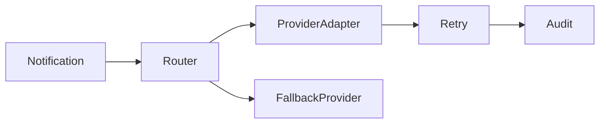

# Lab: Reliable Notification

## Bối cảnh nghiệp vụ

Thông báo đa kênh cần routing, retry, provider fallback và audit.

## Mục tiêu học tập

Lab tập trung vào **Strategy + Adapter + Decorator**. Sau khi hoàn thành, bạn phải giải thích được boundary, invariant, failure path và lý do thiết kế — không chỉ làm test pass.

## Sơ đồ định hướng



## Invariant bắt buộc

- Không gửi trùng ngoài policy
- PII không xuất hiện trong log
- Fallback chỉ cho failure phù hợp

## Nhiệm vụ

1. Thêm provider health score
2. Test permanent vs transient
3. Thiết kế deduplication key

## Cách làm gợi ý

1. Chạy acceptance test của **Reliable Notification** và ghi lại output trước khi sửa code.
2. Xác định nơi đang bảo vệ `Không gửi trùng ngoài policy`; nếu rule nằm ở nhiều chỗ, viết characterization test trước.
3. Tách boundary theo **Strategy + Adapter + Decorator**, chỉ tạo abstraction khi nó làm failure hoặc trục thay đổi rõ hơn.
4. Thêm một test phá vỡ invariant và một test mô phỏng failure đặc trưng của `Reliable Notification`.
5. Chạy solution sau cùng, so sánh dependency direction và giải thích khác biệt bằng trade-off.
## Chạy bài

```bash
php labs/advanced/reliable-notification/tests/acceptance.php
php labs/advanced/reliable-notification/solution/main.php
```

## Tiêu chí review

- Solution bảo vệ rõ invariant: **Không gửi trùng ngoài policy**.
- Contract của **Strategy + Adapter + Decorator** dùng vocabulary của `Reliable Notification`, không dùng tên chung như `Manager` hoặc `Handler` thiếu ngữ nghĩa.
- Failure path của `Reliable Notification` được biểu diễn bằng exception/result có reason cụ thể.
- Test chứng minh behavior và boundary, không khóa chặt thứ tự gọi nội bộ không cần thiết.
- Phần ghi chú nêu được một tình huống mà giải pháp trực tiếp sẽ dễ bảo trì hơn.

## Lời giải định hướng

Mô hình trung tâm là **NotificationAttempt và ChannelRouter**. Hướng triển khai nên bắt đầu từ invariant và state transition, không bắt đầu bằng việc tạo interface theo tên pattern.

1. persist attempt; classify error; fallback có policy; dedup theo message id.
2. Viết characterization test cho baseline, sau đó thêm contract test cho boundary mới.
3. Mô phỏng failure: provider timeout sau accepted. Test phải kiểm tra state cuối và side effect, không chỉ exception.
4. Ghi lại telemetry tối thiểu: delivery latency, fallback ratio và duplicate send.
5. So sánh với giải pháp trực tiếp; chỉ giữ abstraction khi nó làm client biết ít chi tiết hơn hoặc cô lập failure tốt hơn.

### Kết quả mong đợi

- attempt được persist trước khi gọi provider.
- fallback chỉ chạy theo policy.
- accepted-but-unknown chuyển reconciliation.

Chỉ mở [`solution/`](solution/) sau khi bạn đã lưu diagram, test đỏ đầu tiên và giải thích trade-off của bài **reliable notification**.
