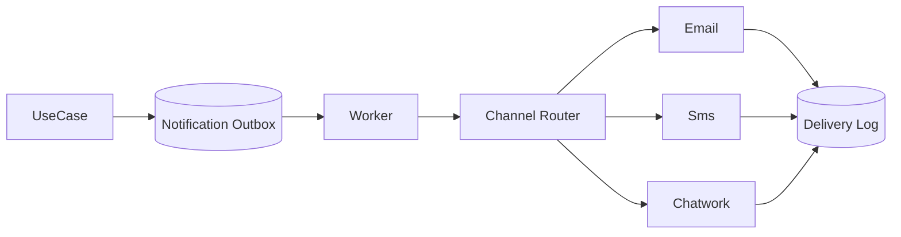

# Lời giải: Reliable Notification

## Kết luận thiết kế

Bài giải sử dụng **Router + Decorators + Outbox** để giải quyết đúng change axis của lab. Application ghi notification intent/outbox, router chọn provider/channel theo policy; decorators xử lý validation, idempotency, retry và telemetry. Delivery status tách accepted/sent/delivered.

## Mô hình lời giải

## Invariant phải giữ

Một intent có operation ID; permanent error không retry; provider fallback không gửi trùng; PII được redaction.

## Trình tự triển khai

1. Chuẩn hóa notification intent và delivery lifecycle.
2. Ghi intent vào outbox.
3. Route theo preference/capability/policy.
4. Bọc channel bằng validation, dedupe, retry, telemetry.
5. Xử lý callback/delivery report idempotently.

## Kiểm thử bắt buộc

Router policy test; decorator order/call count; retry/dead-letter; provider timeout; delivery callback dedupe.

## Trade-off

Reliable notification thêm eventual consistency và trạng thái vận hành. “Sent” không đồng nghĩa “delivered”; fallback/routing phải tránh duplicate và tôn trọng preference/consent.

## Production hardening

- SLO theo accepted-to-delivered latency.
- Provider/channel rate limit và circuit breaker.
- DLQ + replay có approval.
- Redact content, quản lý consent và retention.

## Khi không nên áp dụng

Gửi đồng bộ một email không quan trọng không cần outbox/router nhiều lớp.

## Câu hỏi review

- Router quyết định fallback trong điều kiện nào?
- Một intent có thể tạo bao nhiêu channel attempt?
- Callback duplicate/out-of-order xử lý ra sao?
- Alert nào dẫn tới provider switch và runbook nào?

## Review lời giải bằng evidence

Với **Reliable Notification**, reviewer phải lần theo một scenario từ input đến state/side effect cuối, đối chiếu với invariant: **Một intent có operation ID; permanent error không retry; provider fallback không gửi trùng; PII được redaction.**. Không chấp nhận lời giải chỉ tăng số class nhưng không tạo test tái hiện failure hoặc không làm rõ ownership.

### Checklist cuối

- Retry chỉ cho lỗi transient.
- Message id giữ xuyên provider/fallback.
- Dead-letter có replay và audit.

## Failure walkthrough: provider timeout sau khi đã nhận request

Worker gửi request với `attemptId` ổn định. Nếu timeout, hệ thống không kết luận “chưa gửi”; attempt chuyển sang `unknown` và reconciliation query provider hoặc chờ callback. Chỉ khi provider xác nhận không nhận request mới retry bằng cùng operation identity. Nếu callback đến sau fallback, deduplication theo intent/channel/attempt ngăn gửi trùng.

## Evidence cần lưu khi review

- Trace liên kết intent, outbox message, worker attempt và provider request ID.
- Metric `notification_unknown_outcome_total`, DLQ age và accepted-to-delivered latency.
- Test mô phỏng timeout, callback trễ và replay DLQ.
- Runbook nêu rõ khi nào retry, khi nào reconcile và khi nào chuyển provider.
