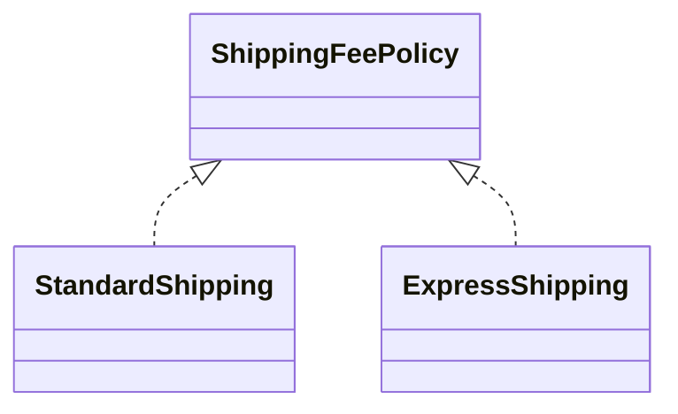

# Lab: Chiến lược tính phí vận chuyển

## Bối cảnh nghiệp vụ

Một checkout đang dùng `if/elseif` để tính phí Standard, Express và Same-day.

## Mục tiêu học tập

Bạn sẽ tách các công thức phí vận chuyển thành ShippingFeePolicy có contract chung. Sau lab, bạn phải thêm một policy mới mà không sửa QuoteService, test invariant phí không âm và giải thích khi `match` trực tiếp vẫn đơn giản hơn Strategy.
## Sơ đồ định hướng



## Invariant bắt buộc

- Phí không âm
- Same-day chỉ áp dụng khu vực hỗ trợ
- Checkout không biết concrete policy

## Nhiệm vụ

1. Thêm `SameDayShipping`
2. Viết contract test dùng chung cho mọi policy
3. Giải thích khi `match` vẫn đơn giản hơn

## Cách làm gợi ý

1. Chạy acceptance test của **Chiến lược tính phí vận chuyển** và ghi lại output trước khi sửa code.
2. Xác định nơi đang bảo vệ `Phí không âm`; nếu rule nằm ở nhiều chỗ, viết characterization test trước.
3. Tách boundary theo **Strategy**, chỉ tạo abstraction khi nó làm failure hoặc trục thay đổi rõ hơn.
4. Thêm một test phá vỡ invariant và một test mô phỏng failure đặc trưng của `Chiến lược tính phí vận chuyển`.
5. Chạy solution sau cùng, so sánh dependency direction và giải thích khác biệt bằng trade-off.
## Chạy bài

```bash
php labs/beginner/04-shipping-strategy/tests/acceptance.php
php labs/beginner/04-shipping-strategy/solution/main.php
```

## Tiêu chí review

- Solution bảo vệ rõ invariant: **Phí không âm**.
- Contract của **Strategy** dùng vocabulary của `Chiến lược tính phí vận chuyển`, không dùng tên chung như `Manager` hoặc `Handler` thiếu ngữ nghĩa.
- Failure path của `Chiến lược tính phí vận chuyển` được biểu diễn bằng exception/result có reason cụ thể.
- Test chứng minh behavior và boundary, không khóa chặt thứ tự gọi nội bộ không cần thiết.
- Phần ghi chú nêu được một tình huống mà giải pháp trực tiếp sẽ dễ bảo trì hơn.

## Lời giải định hướng

Mô hình trung tâm là **ShippingFeePolicy**. Hướng triển khai nên bắt đầu từ invariant và state transition, không bắt đầu bằng việc tạo interface theo tên pattern.

1. mỗi policy trả Money; context không biết concrete class.
2. Viết characterization test cho baseline, sau đó thêm contract test cho boundary mới.
3. Mô phỏng failure: unknown zone hoặc negative weight. Test phải kiểm tra state cuối và side effect, không chỉ exception.
4. Ghi lại telemetry tối thiểu: policy selection count và invalid input.
5. So sánh với giải pháp trực tiếp; chỉ giữ abstraction khi nó làm client biết ít chi tiết hơn hoặc cô lập failure tốt hơn.

### Kết quả mong đợi

- mọi policy trả Money cùng currency.
- unknown zone có error rõ.
- context không dùng if theo concrete strategy.

Chỉ mở [`solution/`](solution/) sau khi bạn đã lưu diagram, test đỏ đầu tiên và giải thích trade-off của bài **04 shipping strategy**.
