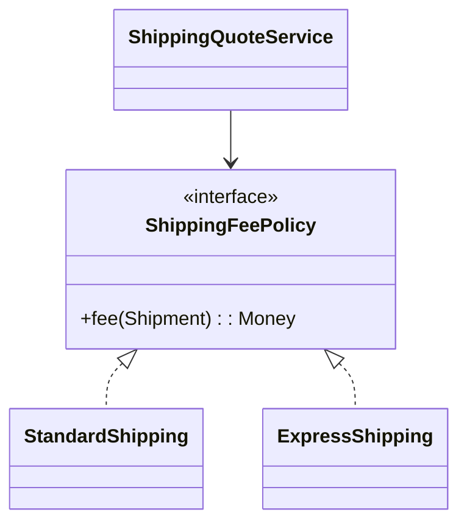

# Lời giải: Shipping Strategy

## Kết luận thiết kế

Bài giải sử dụng **Strategy** để giải quyết đúng change axis của lab. Tách công thức tính phí khỏi use case báo giá. `ShippingQuoteService` chỉ phụ thuộc `ShippingFeePolicy`; mỗi policy phải tuân cùng semantics về đơn vị tiền, vùng giao và điều kiện miễn phí.

## Mô hình lời giải

## Invariant phải giữ

Phí không âm; cùng input và policy cho cùng kết quả; policy không tự chọn policy khác.

## Trình tự triển khai

1. Khóa semantics của phí vận chuyển bằng bảng ví dụ theo zone và weight.
2. Trích `ShippingFeePolicy` từ nhánh điều kiện hiện tại.
3. Chuyển từng công thức vào policy và chạy cùng contract test.
4. Đặt việc chọn policy tại composition/application boundary.
5. Thêm một policy mới mà không sửa `ShippingQuoteService`.

## Kiểm thử bắt buộc

Contract test chạy cho mọi policy; boundary test cho khối lượng âm/vùng không hỗ trợ; test lựa chọn policy tách khỏi test thuật toán.

## Trade-off

Strategy làm việc thêm policy rẻ hơn nhưng phân tán công thức sang nhiều class. Chi phí hợp lý khi chính sách thay đổi độc lập; nếu selection logic phức tạp, registry/factory cũng phải được quản trị.

## Production hardening

- Version policy để giải thích báo giá lịch sử.
- Dùng Money/Decimal, không dùng float.
- Theo dõi tỷ lệ quote lỗi theo zone/policy.
- Shadow-compare policy mới trước rollout.

## Khi không nên áp dụng

Khi chỉ có một công thức ổn định, một function có tên rõ ràng rẻ hơn hierarchy Strategy.

## Câu hỏi review

- Caller hay domain quyết định policy?
- Free-shipping và surcharge có cùng semantics không?
- Contract test nào ngăn policy trả phí âm?
- Làm sao tái hiện báo giá cũ sau khi policy đổi?

## Review lời giải bằng evidence

Với **Shipping Strategy**, reviewer phải lần theo một scenario từ input đến state/side effect cuối, đối chiếu với invariant: **Phí không âm; cùng input và policy cho cùng kết quả; policy không tự chọn policy khác.**. Không chấp nhận lời giải chỉ tăng số class nhưng không tạo test tái hiện failure hoặc không làm rõ ownership.

### Checklist cuối

- Contract test mọi policy với cùng quote semantics.
- Selection tách khỏi calculation.
- Edge case weight/zone được biểu đạt bằng domain error.
