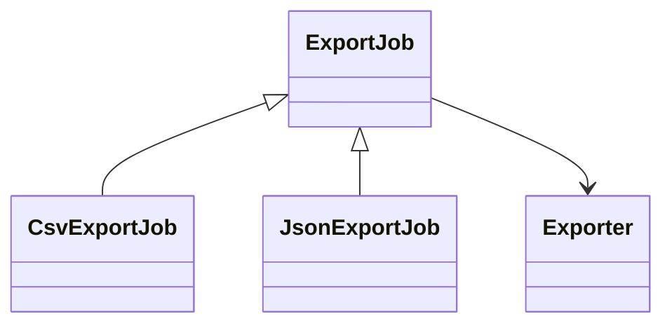

# Lab: Factory cho hệ thống xuất file

## Bối cảnh nghiệp vụ

Một báo cáo cần xuất CSV, JSON và XML nhưng controller đang trực tiếp `new` từng exporter.

## Mục tiêu học tập

Lab tập trung vào **Factory Method**. Sau khi hoàn thành, bạn phải giải thích được boundary, invariant, failure path và lý do thiết kế — không chỉ làm test pass.

## Sơ đồ định hướng



## Invariant bắt buộc

- Mỗi exporter trả nội dung hợp lệ
- Workflow export không lặp
- Creator chịu trách nhiệm tạo product

## Nhiệm vụ

1. Thêm XML exporter
2. Test workflow chung ở abstract creator
3. Phân biệt Factory Method với Simple Factory

## Cách làm gợi ý

1. Chạy acceptance test của **Factory cho hệ thống xuất file** và ghi lại output trước khi sửa code.
2. Xác định nơi đang bảo vệ `Mỗi exporter trả nội dung hợp lệ`; nếu rule nằm ở nhiều chỗ, viết characterization test trước.
3. Tách boundary theo **Factory Method**, chỉ tạo abstraction khi nó làm failure hoặc trục thay đổi rõ hơn.
4. Thêm một test phá vỡ invariant và một test mô phỏng failure đặc trưng của `Factory cho hệ thống xuất file`.
5. Chạy solution sau cùng, so sánh dependency direction và giải thích khác biệt bằng trade-off.
## Chạy bài

```bash
php labs/beginner/05-file-export-factory/tests/acceptance.php
php labs/beginner/05-file-export-factory/solution/main.php
```

## Tiêu chí review

- Solution bảo vệ rõ invariant: **Mỗi exporter trả nội dung hợp lệ**.
- Contract của **Factory Method** dùng vocabulary của `Factory cho hệ thống xuất file`, không dùng tên chung như `Manager` hoặc `Handler` thiếu ngữ nghĩa.
- Failure path của `Factory cho hệ thống xuất file` được biểu diễn bằng exception/result có reason cụ thể.
- Test chứng minh behavior và boundary, không khóa chặt thứ tự gọi nội bộ không cần thiết.
- Phần ghi chú nêu được một tình huống mà giải pháp trực tiếp sẽ dễ bảo trì hơn.

## Lời giải định hướng

Mô hình trung tâm là **Exporter và ExportJob**. Hướng triển khai nên bắt đầu từ invariant và state transition, không bắt đầu bằng việc tạo interface theo tên pattern.

1. creator sở hữu workflow; subclass chọn product.
2. Viết characterization test cho baseline, sau đó thêm contract test cho boundary mới.
3. Mô phỏng failure: format không hỗ trợ hoặc output stream lỗi. Test phải kiểm tra state cuối và side effect, không chỉ exception.
4. Ghi lại telemetry tối thiểu: export duration, failure by format.
5. So sánh với giải pháp trực tiếp; chỉ giữ abstraction khi nó làm client biết ít chi tiết hơn hoặc cô lập failure tốt hơn.

### Kết quả mong đợi

- creator giữ workflow chung.
- mỗi exporter vượt contract test.
- stream failure được propagate có context.

Chỉ mở [`solution/`](solution/) sau khi bạn đã lưu diagram, test đỏ đầu tiên và giải thích trade-off của bài **05 file export factory**.
