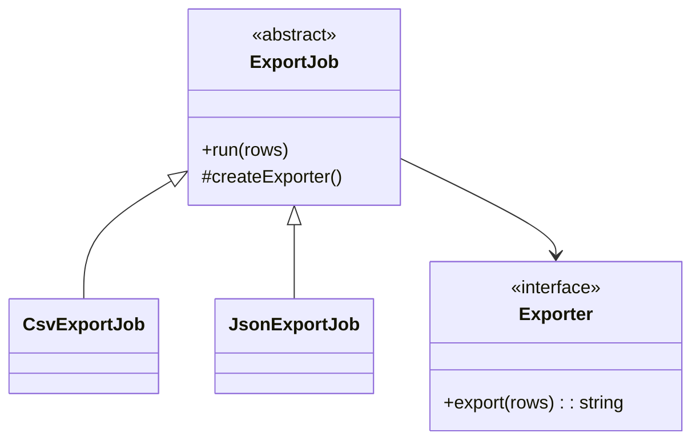

# Lời giải: File Export Factory

## Kết luận thiết kế

Bài giải sử dụng **Factory Method** để giải quyết đúng change axis của lab. Đặt workflow xuất file trong creator và giao bước tạo exporter cho concrete creator. Workflow validate dữ liệu, gọi exporter và trả artifact; subclass chỉ quyết định product.

## Mô hình lời giải

## Invariant phải giữ

Mọi exporter tạo artifact đúng format và workflow không phụ thuộc concrete exporter.

## Trình tự triển khai

1. Xác định phần workflow giống nhau: validate, export, persist artifact.
2. Đưa workflow vào abstract creator.
3. Tạo product contract có output/error rõ ràng.
4. Override duy nhất bước tạo product ở concrete creator.
5. Kiểm tra thêm format mới không làm workflow xuất hiện `switch`.

## Kiểm thử bắt buộc

Contract test cho exporter; template workflow test; test dữ liệu rỗng/encoding/escaping.

## Trade-off

Factory Method giữ workflow nhất quán nhưng dùng inheritance ở creator. Nếu workflow không ổn định hoặc product được chọn runtime, composition/simple factory có thể dễ hiểu hơn.

## Production hardening

- Giới hạn memory bằng streaming cho file lớn.
- Quy định encoding, delimiter và escaping.
- Gắn checksum, row count và schema version vào artifact metadata.
- Quét formula injection khi xuất CSV.

## Khi không nên áp dụng

Nếu chỉ có một `new CsvExporter()` tại composition root, direct construction rõ hơn Factory Method.

## Câu hỏi review

- Workflow có thật sự ổn định giữa các format?
- Concrete creator có override ngoài creation step không?
- Export error có phân biệt invalid data và I/O failure?
- Artifact nào chứng minh file hoàn chỉnh, không bị partial?

## Review lời giải bằng evidence

Với **File Export Factory**, reviewer phải lần theo một scenario từ input đến state/side effect cuối, đối chiếu với invariant: **Mọi exporter tạo artifact đúng format và workflow không phụ thuộc concrete exporter.**. Không chấp nhận lời giải chỉ tăng số class nhưng không tạo test tái hiện failure hoặc không làm rõ ownership.

### Checklist cuối

- Exporter family giữ cùng contract output.
- File resource được đóng khi exception.
- Factory không đọc global config trong domain.
