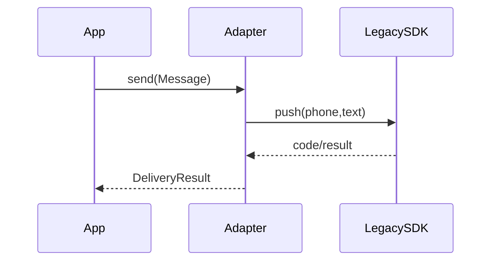

# Lab: Adapter cho API legacy

## Bối cảnh nghiệp vụ

Ứng dụng cần dùng SDK cũ trả mã lỗi và field name khác contract nội bộ.

## Mục tiêu học tập

Bạn sẽ dịch một API legacy có tên field, unit và error code không tương thích sang application contract ổn định. Sau lab, bạn phải chỉ ra mapping request/result, bảo toàn dữ liệu cần chẩn đoán và viết contract test không phụ thuộc SDK thật.
## Sơ đồ định hướng



## Invariant bắt buộc

- Không rò type vendor
- Map timeout/auth/rejection đúng taxonomy
- Adapter không chứa business rule

## Nhiệm vụ

1. Map một failure code mới
2. Viết contract test bằng fake SDK
3. Nêu dữ liệu nào không nên log

## Cách làm gợi ý

1. Chạy acceptance test của **Adapter cho API legacy** và ghi lại output trước khi sửa code.
2. Xác định nơi đang bảo vệ `Không rò type vendor`; nếu rule nằm ở nhiều chỗ, viết characterization test trước.
3. Tách boundary theo **Adapter**, chỉ tạo abstraction khi nó làm failure hoặc trục thay đổi rõ hơn.
4. Thêm một test phá vỡ invariant và một test mô phỏng failure đặc trưng của `Adapter cho API legacy`.
5. Chạy solution sau cùng, so sánh dependency direction và giải thích khác biệt bằng trade-off.
## Chạy bài

```bash
php labs/beginner/06-legacy-api-adapter/tests/acceptance.php
php labs/beginner/06-legacy-api-adapter/solution/main.php
```

## Tiêu chí review

- Solution bảo vệ rõ invariant: **Không rò type vendor**.
- Contract của **Adapter** dùng vocabulary của `Adapter cho API legacy`, không dùng tên chung như `Manager` hoặc `Handler` thiếu ngữ nghĩa.
- Failure path của `Adapter cho API legacy` được biểu diễn bằng exception/result có reason cụ thể.
- Test chứng minh behavior và boundary, không khóa chặt thứ tự gọi nội bộ không cần thiết.
- Phần ghi chú nêu được một tình huống mà giải pháp trực tiếp sẽ dễ bảo trì hơn.

## Lời giải định hướng

Mô hình trung tâm là **WeatherPort và LegacyWeatherAdapter**. Hướng triển khai nên bắt đầu từ invariant và state transition, không bắt đầu bằng việc tạo interface theo tên pattern.

1. map request/response/error tại boundary.
2. Viết characterization test cho baseline, sau đó thêm contract test cho boundary mới.
3. Mô phỏng failure: SDK trả sentinel hoặc timezone khác. Test phải kiểm tra state cuối và side effect, không chỉ exception.
4. Ghi lại telemetry tối thiểu: mapping error và upstream latency.
5. So sánh với giải pháp trực tiếp; chỉ giữ abstraction khi nó làm client biết ít chi tiết hơn hoặc cô lập failure tốt hơn.

### Kết quả mong đợi

- request/response/timezone được map đúng.
- sentinel/error của SDK không rò ra client.
- adapter contract test chạy với fake SDK.

Chỉ mở [`solution/`](solution/) sau khi bạn đã lưu diagram, test đỏ đầu tiên và giải thích trade-off của bài **06 legacy api adapter**.
