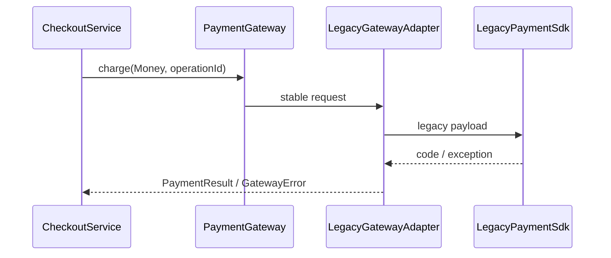

# Lời giải: Legacy API Adapter

## Kết luận thiết kế

Bài giải sử dụng **Adapter** để giải quyết đúng change axis của lab. Giữ application phụ thuộc `PaymentGateway` ổn định, còn adapter dịch amount, status và exception của SDK cũ. Translation phải tập trung ở boundary và không làm domain biết vendor code.

## Mô hình lời giải

## Invariant phải giữ

Một operation ID ánh xạ tới một charge logic; technical error được phân loại thành contract ổn định.

## Trình tự triển khai

1. Viết target port từ nhu cầu của application, không copy SDK.
2. Chụp fixture request/response/error của API cũ.
3. Cài adapter mapping amount, status và exception.
4. Thay call site bằng target port qua composition root.
5. Chạy contract test với fake SDK và một integration smoke test.

## Kiểm thử bắt buộc

Contract test adapter bằng fake SDK; mapping test cho status/exception; test timeout sau success và duplicate request.

## Trade-off

Adapter cô lập vendor churn nhưng tạo thêm mapping phải bảo trì. Giá trị lớn nhất nằm ở error semantics và contract ổn định, không phải chỉ đổi tên method.

## Production hardening

- Pin/version provider schema và lưu raw response đã redaction.
- Đặt timeout budget và retry eligibility theo operation.
- Theo dõi unknown/mapping-error rate.
- Chuẩn bị fallback hoặc migration adapter song song.

## Khi không nên áp dụng

Nếu SDK chỉ được gọi ở một script dùng một lần và không cần contract ổn định, wrapper có thể là dư thừa.

## Câu hỏi review

- Field nào phải được dịch, field nào phải giữ nguyên?
- Unknown provider status được biểu diễn thế nào?
- Timeout sau success được reconcile ra sao?
- Contract test có bắt breaking change của SDK không?

## Review lời giải bằng evidence

Với **Legacy API Adapter**, reviewer phải lần theo một scenario từ input đến state/side effect cuối, đối chiếu với invariant: **Một operation ID ánh xạ tới một charge logic; technical error được phân loại thành contract ổn định.**. Không chấp nhận lời giải chỉ tăng số class nhưng không tạo test tái hiện failure hoặc không làm rõ ownership.

### Checklist cuối

- Mapping request/response có contract test.
- Vendor error được đổi thành stable application error.
- Không rò kiểu SDK vào client.
