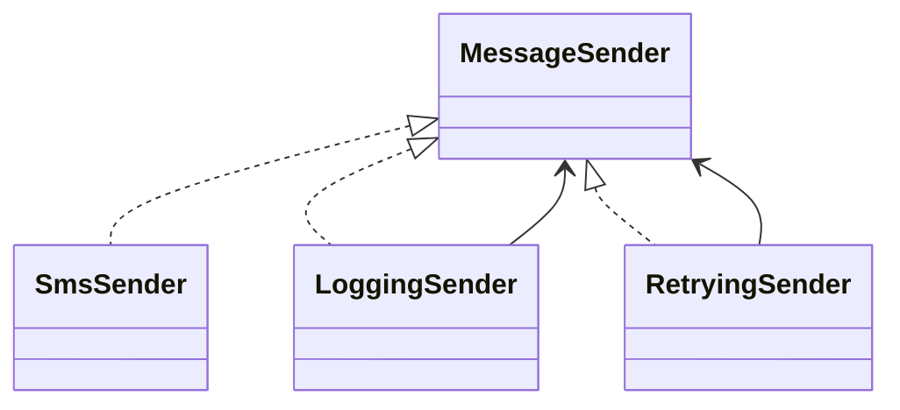

# Lab: Decorator cho message sender

## Bối cảnh nghiệp vụ

Message sender cần logging và retry nhưng không được sửa implementation gốc.

## Mục tiêu học tập

Bạn sẽ tạo chuỗi Decorator cho message sender để thêm prefix, escaping và length validation mà không sửa sender gốc. Sau lab, bạn phải giải thích ảnh hưởng của thứ tự wrapper và viết test chứng minh mỗi decorator chỉ sở hữu một trách nhiệm.
## Sơ đồ định hướng



## Invariant bắt buộc

- Decorator giữ nguyên contract
- Retry chỉ cho lỗi transient
- Thứ tự wrapper được giải thích

## Nhiệm vụ

1. Đổi thứ tự logging/retry và quan sát output
2. Thêm metrics decorator
3. Test lỗi permanent không retry

## Cách làm gợi ý

1. Chạy acceptance test của **Decorator cho message sender** và ghi lại output trước khi sửa code.
2. Xác định nơi đang bảo vệ `Decorator giữ nguyên contract`; nếu rule nằm ở nhiều chỗ, viết characterization test trước.
3. Tách boundary theo **Decorator**, chỉ tạo abstraction khi nó làm failure hoặc trục thay đổi rõ hơn.
4. Thêm một test phá vỡ invariant và một test mô phỏng failure đặc trưng của `Decorator cho message sender`.
5. Chạy solution sau cùng, so sánh dependency direction và giải thích khác biệt bằng trade-off.
## Chạy bài

```bash
php labs/beginner/decorator-message/tests/acceptance.php
php labs/beginner/decorator-message/solution/main.php
```

## Tiêu chí review

- Solution bảo vệ rõ invariant: **Decorator giữ nguyên contract**.
- Contract của **Decorator** dùng vocabulary của `Decorator cho message sender`, không dùng tên chung như `Manager` hoặc `Handler` thiếu ngữ nghĩa.
- Failure path của `Decorator cho message sender` được biểu diễn bằng exception/result có reason cụ thể.
- Test chứng minh behavior và boundary, không khóa chặt thứ tự gọi nội bộ không cần thiết.
- Phần ghi chú nêu được một tình huống mà giải pháp trực tiếp sẽ dễ bảo trì hơn.

## Lời giải định hướng

Mô hình trung tâm là **MessageSender và decorators**. Hướng triển khai nên bắt đầu từ invariant và state transition, không bắt đầu bằng việc tạo interface theo tên pattern.

1. mỗi wrapper một responsibility; order được test.
2. Viết characterization test cho baseline, sau đó thêm contract test cho boundary mới.
3. Mô phỏng failure: retry bọc sai phía validation gây lặp invalid request. Test phải kiểm tra state cuối và side effect, không chỉ exception.
4. Ghi lại telemetry tối thiểu: retry count và validation rejection.
5. So sánh với giải pháp trực tiếp; chỉ giữ abstraction khi nó làm client biết ít chi tiết hơn hoặc cô lập failure tốt hơn.

### Kết quả mong đợi

- validation chặn invalid message trước side effect.
- wrapper order được test.
- inner sender vẫn thay thế được.

Chỉ mở [`solution/`](solution/) sau khi bạn đã lưu diagram, test đỏ đầu tiên và giải thích trade-off của bài **decorator message**.
