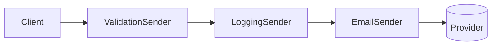

# Lời giải: Message Decorator

## Kết luận thiết kế

Bài giải sử dụng **Decorator** để giải quyết đúng change axis của lab. Các concern validation, logging và formatting được bọc quanh `MessageSender` thay vì nhân subclass. Thứ tự wrapper là một phần behavior nên phải lắp tại composition root và được test.

## Mô hình lời giải

## Invariant phải giữ

Mỗi decorator gọi component đúng số lần; invalid message không đi tới provider; logging không làm thay đổi payload.

## Trình tự triển khai

1. Xác định component contract và behavior cốt lõi.
2. Trích từng concern thành wrapper một trách nhiệm.
3. Chọn order tại composition root và ghi bằng test.
4. Kiểm tra mỗi wrapper gọi component đúng số lần.
5. So sánh chain cuối với một service trực tiếp để tránh over-design.

## Kiểm thử bắt buộc

Test từng decorator cô lập; composition test cho ordering; test provider exception không bị swallow ngoài contract.

## Trade-off

Decorator cho phép composition linh hoạt nhưng call stack và ordering khó debug hơn. Không để decorator phụ thuộc lẫn nhau bằng type concrete hoặc chia sẻ mutable state ngầm.

## Production hardening

- Ghi wrapper chain trong diagnostic log.
- Bảo đảm retry không bọc ngoài idempotency sai thứ tự.
- Redact payload ở logging decorator.
- Đo latency/call count của từng layer.

## Khi không nên áp dụng

Nếu chỉ có một concern cố định và không cần composition, một service rõ ràng có thể dễ đọc hơn chain wrapper.

## Câu hỏi review

- Order nào thay đổi kết quả?
- Wrapper nào được phép short-circuit?
- Exception được translate ở layer nào?
- Có concern nào cần workflow state và nên rời khỏi Decorator?

## Review lời giải bằng evidence

Với **Message Decorator**, reviewer phải lần theo một scenario từ input đến state/side effect cuối, đối chiếu với invariant: **Mỗi decorator gọi component đúng số lần; invalid message không đi tới provider; logging không làm thay đổi payload.**. Không chấp nhận lời giải chỉ tăng số class nhưng không tạo test tái hiện failure hoặc không làm rõ ownership.

### Checklist cuối

- Wrapper order được test vì có thể đổi output.
- Base component vẫn chạy độc lập.
- Decorator không nuốt exception.
