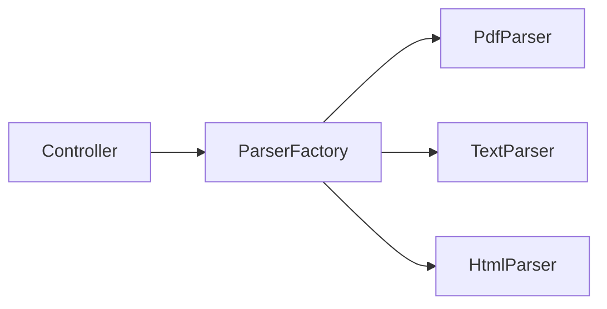

# Lab: Factory cho document parser

## Bối cảnh nghiệp vụ

Ứng dụng import nhiều định dạng tài liệu và đang dùng switch trong controller.

## Mục tiêu học tập

Lab tập trung vào **Factory**. Sau khi hoàn thành, bạn phải giải thích được boundary, invariant, failure path và lý do thiết kế — không chỉ làm test pass.

## Sơ đồ định hướng



## Invariant bắt buộc

- Format không hỗ trợ báo lỗi rõ
- Controller không biết parser cụ thể
- Parser có contract nhất quán

## Nhiệm vụ

1. Thêm Markdown parser
2. Test unsupported format
3. Giải thích ownership của factory

## Cách làm gợi ý

1. Chạy acceptance test của **Factory cho document parser** và ghi lại output trước khi sửa code.
2. Xác định nơi đang bảo vệ `Format không hỗ trợ báo lỗi rõ`; nếu rule nằm ở nhiều chỗ, viết characterization test trước.
3. Tách boundary theo **Factory**, chỉ tạo abstraction khi nó làm failure hoặc trục thay đổi rõ hơn.
4. Thêm một test phá vỡ invariant và một test mô phỏng failure đặc trưng của `Factory cho document parser`.
5. Chạy solution sau cùng, so sánh dependency direction và giải thích khác biệt bằng trade-off.
## Chạy bài

```bash
php labs/beginner/factory-document/tests/acceptance.php
php labs/beginner/factory-document/solution/main.php
```

## Tiêu chí review

- Solution bảo vệ rõ invariant: **Format không hỗ trợ báo lỗi rõ**.
- Contract của **Factory** dùng vocabulary của `Factory cho document parser`, không dùng tên chung như `Manager` hoặc `Handler` thiếu ngữ nghĩa.
- Failure path của `Factory cho document parser` được biểu diễn bằng exception/result có reason cụ thể.
- Test chứng minh behavior và boundary, không khóa chặt thứ tự gọi nội bộ không cần thiết.
- Phần ghi chú nêu được một tình huống mà giải pháp trực tiếp sẽ dễ bảo trì hơn.

## Lời giải định hướng

Mô hình trung tâm là **Document và DocumentCreator**. Hướng triển khai nên bắt đầu từ invariant và state transition, không bắt đầu bằng việc tạo interface theo tên pattern.

1. creator chọn product nhưng workflow render/save dùng contract.
2. Viết characterization test cho baseline, sau đó thêm contract test cho boundary mới.
3. Mô phỏng failure: unsupported document type. Test phải kiểm tra state cuối và side effect, không chỉ exception.
4. Ghi lại telemetry tối thiểu: creation failure by type.
5. So sánh với giải pháp trực tiếp; chỉ giữ abstraction khi nó làm client biết ít chi tiết hơn hoặc cô lập failure tốt hơn.

### Kết quả mong đợi

- document type được tạo qua creator.
- workflow render/save không biết concrete product.
- unsupported type fail fast.

Chỉ mở [`solution/`](solution/) sau khi bạn đã lưu diagram, test đỏ đầu tiên và giải thích trade-off của bài **factory document**.
