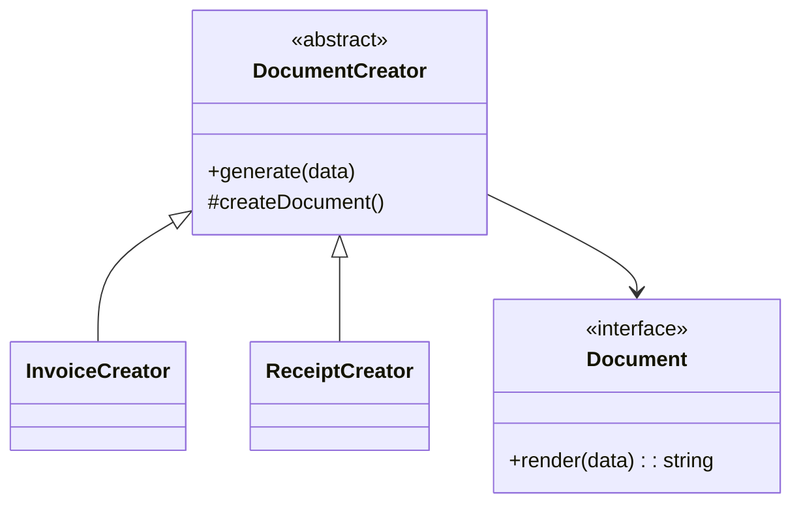

# Lời giải: Document Factory

## Kết luận thiết kế

Bài giải sử dụng **Factory Method** để giải quyết đúng change axis của lab. Creator sở hữu quy trình tạo, render và lưu document; concrete creator lựa chọn `InvoiceDocument` hoặc `ReceiptDocument`. Product contract phải phản ánh hành vi, không chỉ là marker interface.

## Mô hình lời giải

## Invariant phải giữ

Document được tạo phải tương thích workflow và không để creator kiểm tra `instanceof` concrete product.

## Trình tự triển khai

1. Xác định operation chung của Document.
2. Đưa generate workflow vào creator base.
3. Tạo concrete product cho invoice và receipt.
4. Tạo concrete creator chỉ quyết định product.
5. Xóa kiểm tra type khỏi workflow và thêm contract test.

## Kiểm thử bắt buộc

Test workflow một lần bằng test creator; contract test mọi Document; test dữ liệu bắt buộc theo từng loại.

## Trade-off

Factory Method giúp mở rộng họ document mà giữ workflow, nhưng inheritance làm creator khó tổ hợp. Khi product selection dựa dữ liệu runtime, factory function/registry thường phù hợp hơn.

## Production hardening

- Version template và lưu template ID trong metadata.
- Kiểm tra font/locale/timezone khi render.
- Tạo checksum và atomic publish artifact.
- Theo dõi render failure theo document type.

## Khi không nên áp dụng

Simple factory hoặc direct `new` phù hợp hơn nếu workflow không được tái sử dụng qua nhiều creator.

## Câu hỏi review

- Product interface có behavior thật hay chỉ marker?
- Creator subclass có vi phạm LSP không?
- Template change có tái tạo được document lịch sử?
- Rendering failure có để lại file partial không?

## Review lời giải bằng evidence

Với **Document Factory**, reviewer phải lần theo một scenario từ input đến state/side effect cuối, đối chiếu với invariant: **Document được tạo phải tương thích workflow và không để creator kiểm tra `instanceof` concrete product.**. Không chấp nhận lời giải chỉ tăng số class nhưng không tạo test tái hiện failure hoặc không làm rõ ownership.

### Checklist cuối

- Creator sở hữu workflow; subclass chỉ chọn product.
- Test cả CSV/PDF và unsupported format.
- Không biến factory thành switch khổng lồ không có lifecycle value.
