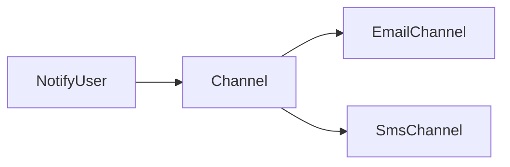

# Lab: Strategy cho kênh thông báo

## Bối cảnh nghiệp vụ

Use case gửi thông báo qua email hoặc SMS theo lựa chọn người dùng.

## Mục tiêu học tập

Bạn sẽ chọn chiến lược gửi Email, SMS hoặc Chatwork theo preference của người dùng mà không đặt provider conditional trong use case. Sau lab, bạn phải test fallback khi channel không khả dụng và phân biệt channel selection với retry/decorator concern.
## Sơ đồ định hướng



## Invariant bắt buộc

- Message validation dùng chung
- Kênh không chứa logic chọn kênh
- Failure semantics nhất quán

## Nhiệm vụ

1. Thêm Chatwork channel
2. Viết contract test
3. So sánh Strategy với Adapter

## Cách làm gợi ý

1. Chạy acceptance test của **Strategy cho kênh thông báo** và ghi lại output trước khi sửa code.
2. Xác định nơi đang bảo vệ `Message validation dùng chung`; nếu rule nằm ở nhiều chỗ, viết characterization test trước.
3. Tách boundary theo **Strategy**, chỉ tạo abstraction khi nó làm failure hoặc trục thay đổi rõ hơn.
4. Thêm một test phá vỡ invariant và một test mô phỏng failure đặc trưng của `Strategy cho kênh thông báo`.
5. Chạy solution sau cùng, so sánh dependency direction và giải thích khác biệt bằng trade-off.
## Chạy bài

```bash
php labs/beginner/strategy-notification/tests/acceptance.php
php labs/beginner/strategy-notification/solution/main.php
```

## Tiêu chí review

- Solution bảo vệ rõ invariant: **Message validation dùng chung**.
- Contract của **Strategy** dùng vocabulary của `Strategy cho kênh thông báo`, không dùng tên chung như `Manager` hoặc `Handler` thiếu ngữ nghĩa.
- Failure path của `Strategy cho kênh thông báo` được biểu diễn bằng exception/result có reason cụ thể.
- Test chứng minh behavior và boundary, không khóa chặt thứ tự gọi nội bộ không cần thiết.
- Phần ghi chú nêu được một tình huống mà giải pháp trực tiếp sẽ dễ bảo trì hơn.

## Lời giải định hướng

Mô hình trung tâm là **NotificationChannel**. Hướng triển khai nên bắt đầu từ invariant và state transition, không bắt đầu bằng việc tạo interface theo tên pattern.

1. strategy tách channel semantics; selector ở composition root.
2. Viết characterization test cho baseline, sau đó thêm contract test cho boundary mới.
3. Mô phỏng failure: channel permanent failure. Test phải kiểm tra state cuối và side effect, không chỉ exception.
4. Ghi lại telemetry tối thiểu: delivery result by channel.
5. So sánh với giải pháp trực tiếp; chỉ giữ abstraction khi nó làm client biết ít chi tiết hơn hoặc cô lập failure tốt hơn.

### Kết quả mong đợi

- channel contract thống nhất result.
- selector nằm ngoài use case.
- permanent failure không retry mù.

Chỉ mở [`solution/`](solution/) sau khi bạn đã lưu diagram, test đỏ đầu tiên và giải thích trade-off của bài **strategy notification**.
