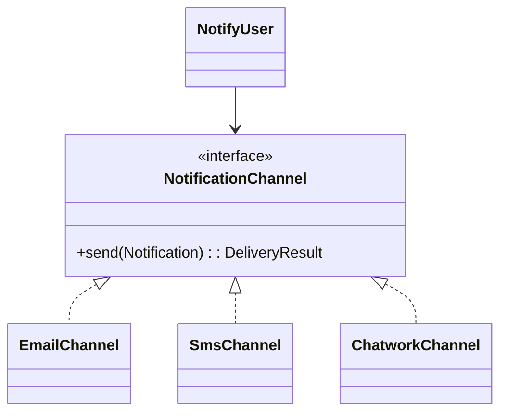

# Lời giải: Notification Strategy

## Kết luận thiết kế

Bài giải sử dụng **Strategy** để giải quyết đúng change axis của lab. Use case chọn channel tại composition/application boundary rồi gọi contract `NotificationChannel`. Email, SMS và Chatwork tự chịu trách nhiệm validation/mapping của kênh, nhưng nhận cùng message semantics.

## Mô hình lời giải

## Invariant phải giữ

Một notification logic không được gửi hai lần do retry; recipient/message semantics nhất quán giữa channel.

## Trình tự triển khai

1. Chuẩn hóa Notification, Recipient và DeliveryResult.
2. Cài từng channel theo cùng contract.
3. Viết contract test dùng chung cho error classification.
4. Tách routing/selection khỏi channel implementation.
5. Mô phỏng provider failure và xác nhận caller không biết vendor detail.

## Kiểm thử bắt buộc

Contract test mọi channel; selection test; permanent/temporary error mapping; idempotency test nếu có retry.

## Trade-off

Strategy làm channel thay thế được nhưng không tự giải quyết reliability hoặc routing nhiều kênh. Khi workflow cần fallback/retry/outbox, phải phối hợp thêm application service/decorator.

## Production hardening

- Dùng operation ID xuyên channel và provider.
- Phân loại accepted/sent/delivered.
- Redact PII và secret.
- Đặt channel-specific rate limit và circuit breaker.

## Khi không nên áp dụng

Nếu hệ thống chỉ gửi email và không có khả năng thay channel, interface nhiều implementation là chưa cần thiết.

## Câu hỏi review

- Channel contract có thống nhất được delivery semantics không?
- Routing dựa preference nằm ở đâu?
- Provider accepted nhưng callback thất lạc xử lý thế nào?
- Fallback có nguy cơ gửi hai kênh ngoài ý muốn không?

## Review lời giải bằng evidence

Với **Notification Strategy**, reviewer phải lần theo một scenario từ input đến state/side effect cuối, đối chiếu với invariant: **Một notification logic không được gửi hai lần do retry; recipient/message semantics nhất quán giữa channel.**. Không chấp nhận lời giải chỉ tăng số class nhưng không tạo test tái hiện failure hoặc không làm rõ ownership.

### Checklist cuối

- Channel policy không trộn message rendering.
- Failure transient/permanent được phân loại.
- Test fallback không gửi duplicate.
