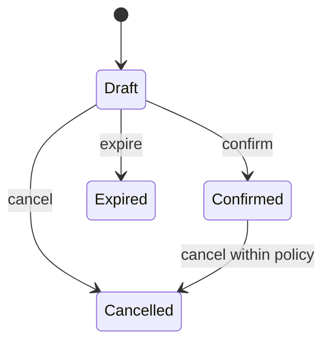

# Lab: State machine cho Booking

## Bối cảnh nghiệp vụ

Booking có Draft, Confirmed, Cancelled và Expired; một số transition bị cấm.

## Mục tiêu học tập

Lab tập trung vào **State**. Sau khi hoàn thành, bạn phải giải thích được boundary, invariant, failure path và lý do thiết kế — không chỉ làm test pass.

## Sơ đồ định hướng



## Invariant bắt buộc

- Không confirm booking đã cancelled
- Side effect chỉ chạy sau transition thành công
- Illegal transition có reason code

## Nhiệm vụ

1. Thêm cancellation policy
2. Test bảng transition
3. Vẽ state diagram cập nhật

## Cách làm gợi ý

1. Chạy acceptance test của **State machine cho Booking** và ghi lại output trước khi sửa code.
2. Xác định nơi đang bảo vệ `Không confirm booking đã cancelled`; nếu rule nằm ở nhiều chỗ, viết characterization test trước.
3. Tách boundary theo **State**, chỉ tạo abstraction khi nó làm failure hoặc trục thay đổi rõ hơn.
4. Thêm một test phá vỡ invariant và một test mô phỏng failure đặc trưng của `State machine cho Booking`.
5. Chạy solution sau cùng, so sánh dependency direction và giải thích khác biệt bằng trade-off.
## Chạy bài

```bash
php labs/intermediate/04-booking-state-machine/tests/acceptance.php
php labs/intermediate/04-booking-state-machine/solution/main.php
```

## Tiêu chí review

- Solution bảo vệ rõ invariant: **Không confirm booking đã cancelled**.
- Contract của **State** dùng vocabulary của `State machine cho Booking`, không dùng tên chung như `Manager` hoặc `Handler` thiếu ngữ nghĩa.
- Failure path của `State machine cho Booking` được biểu diễn bằng exception/result có reason cụ thể.
- Test chứng minh behavior và boundary, không khóa chặt thứ tự gọi nội bộ không cần thiết.
- Phần ghi chú nêu được một tình huống mà giải pháp trực tiếp sẽ dễ bảo trì hơn.

## Lời giải định hướng

Mô hình trung tâm là **Booking và BookingState**. Hướng triển khai nên bắt đầu từ invariant và state transition, không bắt đầu bằng việc tạo interface theo tên pattern.

1. transition table explicit; guard kiểm tra expiry/version.
2. Viết characterization test cho baseline, sau đó thêm contract test cho boundary mới.
3. Mô phỏng failure: confirm sau hold expiry. Test phải kiểm tra state cuối và side effect, không chỉ exception.
4. Ghi lại telemetry tối thiểu: illegal transition và hold expiration.
5. So sánh với giải pháp trực tiếp; chỉ giữ abstraction khi nó làm client biết ít chi tiết hơn hoặc cô lập failure tốt hơn.

### Kết quả mong đợi

- hold hết hạn không thể confirm.
- cancel/confirm race dùng version.
- mọi transition ghi audit reason.

Chỉ mở [`solution/`](solution/) sau khi bạn đã lưu diagram, test đỏ đầu tiên và giải thích trade-off của bài **04 booking state machine**.
