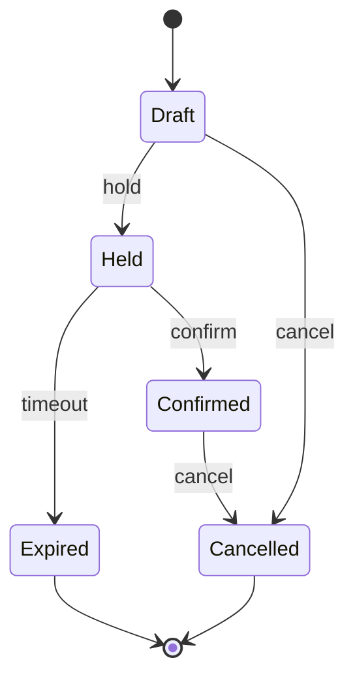

# Lời giải: Booking State Machine

## Kết luận thiết kế

Bài giải sử dụng **State** để giải quyết đúng change axis của lab. Đặt transition hợp lệ trong state/lifecycle model thay vì rải `if` ở controller. Side effect như email hoặc refund được phát sau transition bền vững, không nằm trong state object.

## Mô hình lời giải

## Invariant phải giữ

Không có transition ngoài bảng; confirm chỉ xảy ra khi hold còn hiệu lực; version stale bị từ chối.

## Trình tự triển khai

1. Liệt kê state và command trong transition table.
2. Viết test cho mọi transition hợp lệ/bất hợp lệ.
3. Chuyển guard/transition vào lifecycle model.
4. Phát domain event sau state change, giữ side effect ngoài model.
5. Thêm clock/version để kiểm tra expiry và stale command.

## Kiểm thử bắt buộc

Transition table tests; clock-controlled expiry; optimistic concurrency test; event-after-commit test.

## Trade-off

State model làm lifecycle minh bạch nhưng tăng type hoặc transition table phải bảo trì. Không nhét integration side effect vào state object vì làm transition khó atomic/test.

## Production hardening

- Persist state cùng version và transition metadata.
- Dùng server clock thống nhất cho hold expiry.
- Metric illegal/stale transition và stuck booking.
- Runbook reconcile booking với payment/inventory.

## Khi không nên áp dụng

Enum + switch có thể tốt hơn khi chỉ có vài transition ổn định và state không có behavior riêng.

## Câu hỏi review

- State nào sở hữu guard availability?
- Cancel sau confirm có cần compensation nào?
- Expiry job và confirm race được serialize ra sao?
- Event được phát trước hay sau commit?

## Review lời giải bằng evidence

Với **Booking State Machine**, reviewer phải lần theo một scenario từ input đến state/side effect cuối, đối chiếu với invariant: **Không có transition ngoài bảng; confirm chỉ xảy ra khi hold còn hiệu lực; version stale bị từ chối.**. Không chấp nhận lời giải chỉ tăng số class nhưng không tạo test tái hiện failure hoặc không làm rõ ownership.

### Checklist cuối

- Illegal transition bị chặn.
- Guard thời gian/capacity deterministic.
- Side effect phát sau state commit.
