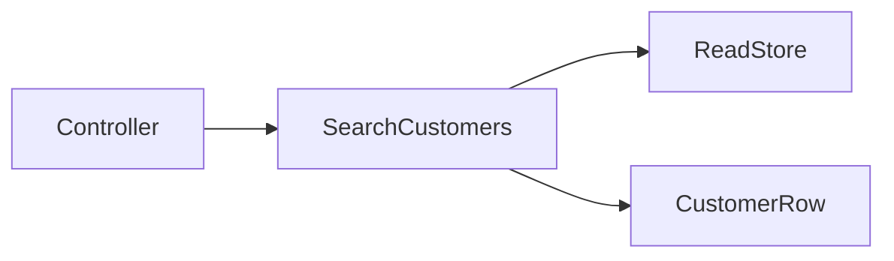

# Lab: Query Object cho tìm kiếm khách hàng

## Bối cảnh nghiệp vụ

Màn hình CRM cần filter email, trạng thái, sort và limit mà không làm phình Repository.

## Mục tiêu học tập

Sau lab này, bạn phải thiết kế một Query Object cho CRM có criteria bất biến, limit được validate và projection không rò ORM. Bạn cần giải thích index phục vụ email/status, cách biểu diễn cursor và cách phân biệt lỗi input với lỗi read-store.

## Sơ đồ định hướng



## Invariant bắt buộc

- Limit có biên hợp lệ
- Query trả projection
- Không rò ORM builder

## Nhiệm vụ

1. Thêm cursor pagination
2. Test filter kết hợp
3. Nêu index cần thiết

## Cách làm gợi ý

1. Chạy acceptance test của **Query Object cho tìm kiếm khách hàng** và ghi lại output trước khi sửa code.
2. Xác định nơi đang bảo vệ `Limit có biên hợp lệ`; nếu rule nằm ở nhiều chỗ, viết characterization test trước.
3. Tách boundary theo **Query Object**, chỉ tạo abstraction khi nó làm failure hoặc trục thay đổi rõ hơn.
4. Thêm một test phá vỡ invariant và một test mô phỏng failure đặc trưng của `Query Object cho tìm kiếm khách hàng`.
5. Chạy solution sau cùng, so sánh dependency direction và giải thích khác biệt bằng trade-off.
## Chạy bài

```bash
php labs/intermediate/06-customer-query-object/tests/acceptance.php
php labs/intermediate/06-customer-query-object/solution/main.php
```

## Tiêu chí review

- Solution bảo vệ rõ invariant: **Limit có biên hợp lệ**.
- Contract của **Query Object** dùng vocabulary của `Query Object cho tìm kiếm khách hàng`, không dùng tên chung như `Manager` hoặc `Handler` thiếu ngữ nghĩa.
- Failure path của `Query Object cho tìm kiếm khách hàng` được biểu diễn bằng exception/result có reason cụ thể.
- Test chứng minh behavior và boundary, không khóa chặt thứ tự gọi nội bộ không cần thiết.
- Phần ghi chú nêu được một tình huống mà giải pháp trực tiếp sẽ dễ bảo trì hơn.

## Lời giải định hướng

Mô hình trung tâm là **CustomerQuery và CustomerProjection**. Hướng triển khai nên bắt đầu từ invariant và state transition, không bắt đầu bằng việc tạo interface theo tên pattern.

1. criteria immutable; cursor ổn định; projection không hydrate aggregate.
2. Viết characterization test cho baseline, sau đó thêm contract test cho boundary mới.
3. Mô phỏng failure: sort không deterministic làm trùng/mất record. Test phải kiểm tra state cuối và side effect, không chỉ exception.
4. Ghi lại telemetry tối thiểu: query latency và cursor errors.
5. So sánh với giải pháp trực tiếp; chỉ giữ abstraction khi nó làm client biết ít chi tiết hơn hoặc cô lập failure tốt hơn.

### Kết quả mong đợi

- sort có tie-breaker ổn định.
- cursor invalid có error contract.
- projection không hydrate aggregate.

Chỉ mở [`solution/`](solution/) sau khi bạn đã lưu diagram, test đỏ đầu tiên và giải thích trade-off của bài **06 customer query object**.
