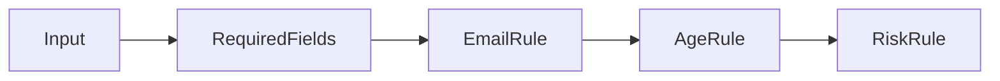

# Lab: Chain of Responsibility cho validation

## Bối cảnh nghiệp vụ

Một request onboarding đi qua nhiều rule và cần dừng ở lỗi đầu tiên hoặc thu thập toàn bộ lỗi.

## Mục tiêu học tập

Lab tập trung vào **Chain of Responsibility**. Sau khi hoàn thành, bạn phải giải thích được boundary, invariant, failure path và lý do thiết kế — không chỉ làm test pass.

## Sơ đồ định hướng



## Invariant bắt buộc

- Thứ tự rule có chủ đích
- Không nuốt lỗi infrastructure
- Có chế độ fail-fast/collect-all

## Nhiệm vụ

1. Thêm risk rule
2. Test short-circuit
3. So sánh Chain với Pipeline

## Cách làm gợi ý

1. Chạy acceptance test của **Chain of Responsibility cho validation** và ghi lại output trước khi sửa code.
2. Xác định nơi đang bảo vệ `Thứ tự rule có chủ đích`; nếu rule nằm ở nhiều chỗ, viết characterization test trước.
3. Tách boundary theo **Chain of Responsibility**, chỉ tạo abstraction khi nó làm failure hoặc trục thay đổi rõ hơn.
4. Thêm một test phá vỡ invariant và một test mô phỏng failure đặc trưng của `Chain of Responsibility cho validation`.
5. Chạy solution sau cùng, so sánh dependency direction và giải thích khác biệt bằng trade-off.
## Chạy bài

```bash
php labs/intermediate/chain-validation/tests/acceptance.php
php labs/intermediate/chain-validation/solution/main.php
```

## Tiêu chí review

- Solution bảo vệ rõ invariant: **Thứ tự rule có chủ đích**.
- Contract của **Chain of Responsibility** dùng vocabulary của `Chain of Responsibility cho validation`, không dùng tên chung như `Manager` hoặc `Handler` thiếu ngữ nghĩa.
- Failure path của `Chain of Responsibility cho validation` được biểu diễn bằng exception/result có reason cụ thể.
- Test chứng minh behavior và boundary, không khóa chặt thứ tự gọi nội bộ không cần thiết.
- Phần ghi chú nêu được một tình huống mà giải pháp trực tiếp sẽ dễ bảo trì hơn.

## Lời giải định hướng

Mô hình trung tâm là **ValidationHandler**. Hướng triển khai nên bắt đầu từ invariant và state transition, không bắt đầu bằng việc tạo interface theo tên pattern.

1. handler trả violations có code; chain dừng hay gom lỗi phải explicit.
2. Viết characterization test cho baseline, sau đó thêm contract test cho boundary mới.
3. Mô phỏng failure: thứ tự handler che mất lỗi quan trọng. Test phải kiểm tra state cuối và side effect, không chỉ exception.
4. Ghi lại telemetry tối thiểu: violations by code.
5. So sánh với giải pháp trực tiếp; chỉ giữ abstraction khi nó làm client biết ít chi tiết hơn hoặc cô lập failure tốt hơn.

### Kết quả mong đợi

- violation có code/path.
- chain order có test.
- mode fail-fast/gom lỗi explicit.

Chỉ mở [`solution/`](solution/) sau khi bạn đã lưu diagram, test đỏ đầu tiên và giải thích trade-off của bài **chain validation**.
