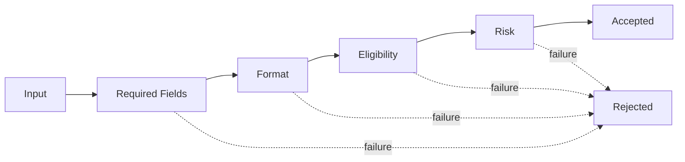

# Lời giải: Validation Chain

## Kết luận thiết kế

Bài giải sử dụng **Chain of Responsibility** để giải quyết đúng change axis của lab. Mỗi validator kiểm tra một điều kiện và quyết định pass tiếp hoặc trả failure có reason code. Chain order phải được định nghĩa rõ khi rule có dependency.

## Mô hình lời giải

## Invariant phải giữ

Failure đầu tiên hoặc tập hợp failure phải theo contract đã chọn; validator không sửa input ngoài ý muốn.

## Trình tự triển khai

1. Viết error contract và quyết định fail-fast hay collect-all.
2. Tách từng rule thành handler thuần.
3. Cấu hình thứ tự và dependency giữa rule.
4. Test short-circuit/call order.
5. Thêm rule mới mà không sửa handler cũ.

## Kiểm thử bắt buộc

Test từng handler; ordering/short-circuit test; reason-code contract; property test cho input bất kỳ không gây exception không kiểm soát.

## Trade-off

Chain linh hoạt với rule có thể bật/tắt nhưng thứ tự dễ trở thành business logic ẩn. Nếu rule độc lập thuần túy, collection predicate đơn giản hơn và dễ debug hơn.

## Production hardening

- Gắn rule ID/version vào rejection.
- Metric rejection theo rule và cohort.
- Bảo vệ chain config bằng schema/validation.
- Snapshot explanation cho audit khi rule đổi.

## Khi không nên áp dụng

Một danh sách predicate thuần có thể đơn giản hơn nếu không cần short-circuit object, context hoặc handler reuse.

## Câu hỏi review

- Fail-fast hay collect-all là contract nào?
- Rule nào phụ thuộc output của rule trước?
- Có handler nào mutate context gây order coupling?
- Làm sao tái hiện decision lịch sử?

## Review lời giải bằng evidence

Với **Validation Chain**, reviewer phải lần theo một scenario từ input đến state/side effect cuối, đối chiếu với invariant: **Failure đầu tiên hoặc tập hợp failure phải theo contract đã chọn; validator không sửa input ngoài ý muốn.**. Không chấp nhận lời giải chỉ tăng số class nhưng không tạo test tái hiện failure hoặc không làm rõ ownership.

### Checklist cuối

- Handler order và short-circuit được test.
- Error giữ context field/rule.
- Chain không dùng cho rule cần tổng hợp toàn cục.
