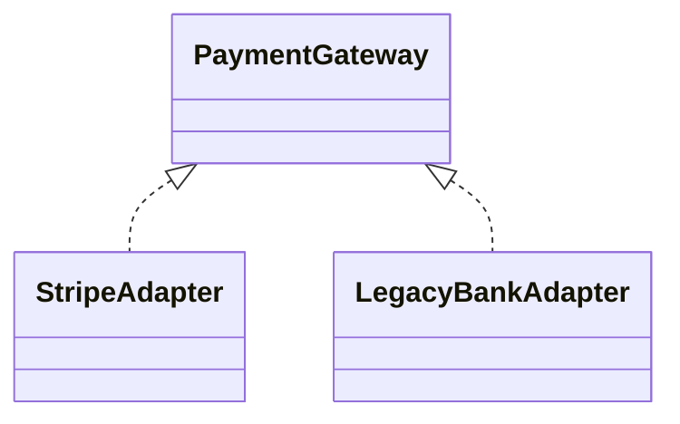

# Lab: Adapter cho payment gateway

## Bối cảnh nghiệp vụ

Hai gateway có request, response và error model khác nhau nhưng checkout cần một contract.

## Mục tiêu học tập

Bạn sẽ xây PaymentGateway Adapter cho provider bên ngoài, bao gồm money conversion, timeout classification, provider reference và duplicate-charge safety. Mục tiêu là giữ checkout không biết vendor type nhưng vẫn có đủ evidence để reconciliation.
## Sơ đồ định hướng



## Invariant bắt buộc

- Idempotency key được truyền đúng
- Currency/amount mapping không mất dữ liệu
- Error được chuẩn hóa

## Nhiệm vụ

1. Thêm gateway thứ ba
2. Contract test adapter
3. Test timeout và decline khác nhau

## Cách làm gợi ý

1. Chạy acceptance test của **Adapter cho payment gateway** và ghi lại output trước khi sửa code.
2. Xác định nơi đang bảo vệ `Idempotency key được truyền đúng`; nếu rule nằm ở nhiều chỗ, viết characterization test trước.
3. Tách boundary theo **Adapter**, chỉ tạo abstraction khi nó làm failure hoặc trục thay đổi rõ hơn.
4. Thêm một test phá vỡ invariant và một test mô phỏng failure đặc trưng của `Adapter cho payment gateway`.
5. Chạy solution sau cùng, so sánh dependency direction và giải thích khác biệt bằng trade-off.
## Chạy bài

```bash
php labs/intermediate/payment-adapter/tests/acceptance.php
php labs/intermediate/payment-adapter/solution/main.php
```

## Tiêu chí review

- Solution bảo vệ rõ invariant: **Idempotency key được truyền đúng**.
- Contract của **Adapter** dùng vocabulary của `Adapter cho payment gateway`, không dùng tên chung như `Manager` hoặc `Handler` thiếu ngữ nghĩa.
- Failure path của `Adapter cho payment gateway` được biểu diễn bằng exception/result có reason cụ thể.
- Test chứng minh behavior và boundary, không khóa chặt thứ tự gọi nội bộ không cần thiết.
- Phần ghi chú nêu được một tình huống mà giải pháp trực tiếp sẽ dễ bảo trì hơn.

## Lời giải định hướng

Mô hình trung tâm là **PaymentGateway và ProviderAdapter**. Hướng triển khai nên bắt đầu từ invariant và state transition, không bắt đầu bằng việc tạo interface theo tên pattern.

1. normalize status/error/idempotency key.
2. Viết characterization test cho baseline, sau đó thêm contract test cho boundary mới.
3. Mô phỏng failure: provider timeout sau capture. Test phải kiểm tra state cuối và side effect, không chỉ exception.
4. Ghi lại telemetry tối thiểu: ambiguous outcome và mapping failure.
5. So sánh với giải pháp trực tiếp; chỉ giữ abstraction khi nó làm client biết ít chi tiết hơn hoặc cô lập failure tốt hơn.

### Kết quả mong đợi

- provider status chuẩn hóa.
- idempotency key được truyền đúng.
- timeout-after-capture tạo ambiguous result.

Chỉ mở [`solution/`](solution/) sau khi bạn đã lưu diagram, test đỏ đầu tiên và giải thích trade-off của bài **payment adapter**.
