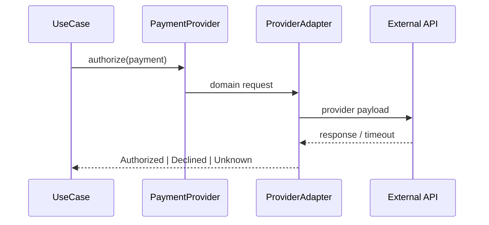

# Lời giải: Payment Adapter

## Kết luận thiết kế

Bài giải sử dụng **Adapter** để giải quyết đúng change axis của lab. Adapter ánh xạ `Money`, operation ID và error model giữa domain payment port với provider SDK. Không để provider status hoặc exception lọt vào application layer.

## Mô hình lời giải

## Invariant phải giữ

Unknown result khác Declined; retry chỉ khi idempotency được bảo đảm; amount/currency không bị thay đổi khi mapping.

## Trình tự triển khai

1. Định nghĩa PaymentProvider port và stable result union.
2. Ghi fixture cho provider success/decline/timeout.
3. Map request và response trong adapter.
4. Map exception/status thành temporary/permanent/unknown.
5. Chạy timeout-after-success và reconciliation test.

## Kiểm thử bắt buộc

Contract test port; fixture test provider payload; timeout-after-success scenario; redaction/logging test.

## Trade-off

Adapter giảm vendor coupling nhưng mapping sai có thể gây lỗi tiền nghiêm trọng. Vì vậy adapter cần fixture/contract test và raw evidence được redaction, không chỉ unit mock.

## Production hardening

- Lưu provider request/reference cho reconciliation.
- Dùng Decimal/Money và kiểm tra currency exponent.
- Đặt idempotency key tại provider boundary.
- Alert unknown result và mapping error.

## Khi không nên áp dụng

Không cần Adapter tổng quát nếu integration cô lập, không tái sử dụng và provider contract đã chính là application contract.

## Câu hỏi review

- Declined và unknown có bị gộp không?
- Provider retry semantics có được tài liệu hóa?
- Webhook status có map cùng model với sync response?
- Raw response được lưu an toàn để điều tra không?

## Review lời giải bằng evidence

Với **Payment Adapter**, reviewer phải lần theo một scenario từ input đến state/side effect cuối, đối chiếu với invariant: **Unknown result khác Declined; retry chỉ khi idempotency được bảo đảm; amount/currency không bị thay đổi khi mapping.**. Không chấp nhận lời giải chỉ tăng số class nhưng không tạo test tái hiện failure hoặc không làm rõ ownership.

### Checklist cuối

- Stable port không chứa vendor DTO.
- Timeout/conflict mapping riêng.
- Contract test chạy cho mọi provider.
