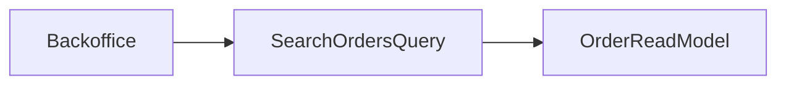

# Lab: Query Object cho danh sách đơn hàng

## Bối cảnh nghiệp vụ

Backoffice cần filter theo ngày, trạng thái, customer và sort mới nhất.

## Mục tiêu học tập

Sau lab này, bạn phải thiết kế truy vấn backoffice theo half-open date range, sort ổn định bằng `created_at + id` và cursor pagination không bỏ sót/đọc trùng order. Bạn cần đề xuất composite index và test boundary ngày/thời gian.

## Sơ đồ định hướng



## Invariant bắt buộc

- Date range dùng half-open interval
- Pagination ổn định
- Projection chỉ chứa field cần thiết

## Nhiệm vụ

1. Thêm cursor theo created_at+id
2. Nêu composite index
3. Test boundary ngày

## Cách làm gợi ý

1. Chạy acceptance test của **Query Object cho danh sách đơn hàng** và ghi lại output trước khi sửa code.
2. Xác định nơi đang bảo vệ `Date range dùng half-open interval`; nếu rule nằm ở nhiều chỗ, viết characterization test trước.
3. Tách boundary theo **Query Object**, chỉ tạo abstraction khi nó làm failure hoặc trục thay đổi rõ hơn.
4. Thêm một test phá vỡ invariant và một test mô phỏng failure đặc trưng của `Query Object cho danh sách đơn hàng`.
5. Chạy solution sau cùng, so sánh dependency direction và giải thích khác biệt bằng trade-off.
## Chạy bài

```bash
php labs/intermediate/query-object-orders/tests/acceptance.php
php labs/intermediate/query-object-orders/solution/main.php
```

## Tiêu chí review

- Solution bảo vệ rõ invariant: **Date range dùng half-open interval**.
- Contract của **Query Object** dùng vocabulary của `Query Object cho danh sách đơn hàng`, không dùng tên chung như `Manager` hoặc `Handler` thiếu ngữ nghĩa.
- Failure path của `Query Object cho danh sách đơn hàng` được biểu diễn bằng exception/result có reason cụ thể.
- Test chứng minh behavior và boundary, không khóa chặt thứ tự gọi nội bộ không cần thiết.
- Phần ghi chú nêu được một tình huống mà giải pháp trực tiếp sẽ dễ bảo trì hơn.

## Lời giải định hướng

Mô hình trung tâm là **OrderSearchQuery**. Hướng triển khai nên bắt đầu từ invariant và state transition, không bắt đầu bằng việc tạo interface theo tên pattern.

1. read model tách write model; filters/pagination explicit.
2. Viết characterization test cho baseline, sau đó thêm contract test cho boundary mới.
3. Mô phỏng failure: replica stale hoặc cursor hết hạn. Test phải kiểm tra state cuối và side effect, không chỉ exception.
4. Ghi lại telemetry tối thiểu: query p95 và stale read rate.
5. So sánh với giải pháp trực tiếp; chỉ giữ abstraction khi nó làm client biết ít chi tiết hơn hoặc cô lập failure tốt hơn.

### Kết quả mong đợi

- filters không làm thay sort.
- pagination không mất/trùng row.
- stale read policy được ghi rõ.

Chỉ mở [`solution/`](solution/) sau khi bạn đã lưu diagram, test đỏ đầu tiên và giải thích trade-off của bài **query object orders**.
