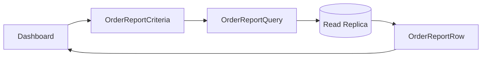

# Lời giải: Order Query Object

## Kết luận thiết kế

Bài giải sử dụng **Query Object** để giải quyết đúng change axis của lab. Tạo projection đơn hàng cho dashboard bằng query chuyên biệt, có filter ngày/status, stable ordering và cursor. Không ép report đi qua aggregate repository.

## Mô hình lời giải

## Invariant phải giữ

Report chấp nhận eventual consistency đã công bố; pagination ổn định; tổng hợp không double count order line.

## Trình tự triển khai

1. Xác định report row và filter semantics.
2. Tạo golden dataset gồm boundary date/status.
3. Cài query với stable order và cursor.
4. Kiểm tra index/plan và query count.
5. Công bố consistency/lag của read source.

## Kiểm thử bắt buộc

Golden dataset test; query plan/index evidence; boundary date test; replica lag behavior.

## Trade-off

Order Query Object tối ưu báo cáo nhưng tạo model khác aggregate. Team phải chấp nhận mapping/schema evolution và không dùng projection để thực hiện domain mutation.

## Production hardening

- Metric latency, timeout và replica lag.
- Limit range/page size và rate-limit export.
- Version report schema.
- Reconcile aggregate count với source of truth định kỳ.

## Khi không nên áp dụng

Repository method vẫn phù hợp nếu read use case nhỏ và dùng cùng semantics với aggregate lookup.

## Câu hỏi review

- Date range inclusive/exclusive ra sao?
- Cursor có ổn định khi record mới chèn không?
- Tổng tiền lấy snapshot hay recompute?
- Query có dùng read replica khi cần read-your-write không?

## Review lời giải bằng evidence

Với **Order Query Object**, reviewer phải lần theo một scenario từ input đến state/side effect cuối, đối chiếu với invariant: **Report chấp nhận eventual consistency đã công bố; pagination ổn định; tổng hợp không double count order line.**. Không chấp nhận lời giải chỉ tăng số class nhưng không tạo test tái hiện failure hoặc không làm rõ ownership.

### Checklist cuối

- Filter/sort/cursor semantics rõ.
- Query không trả aggregate cho write.
- SQL/index budget được kiểm tra.

## Query semantics cần khóa bằng contract test

Cursor phải dựa trên sort key ổn định như `(created_at, id)`, filter phải được chuẩn hóa trước khi tạo query và projection không được trả aggregate mutable. Contract test chạy cùng dataset trên in-memory fixture và database adapter để bảo đảm ordering, pagination boundary và null semantics giống nhau.

## Evidence cần lưu khi review

- `EXPLAIN` của query production với dataset đại diện.
- Test không bỏ sót/nhân đôi record khi nhiều row có cùng timestamp.
- Metric query latency, scanned rows và cursor error rate.
- ADR ghi lý do Query Object tốt hơn repository method tổng quát trong use case này.
