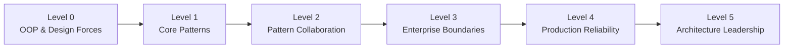
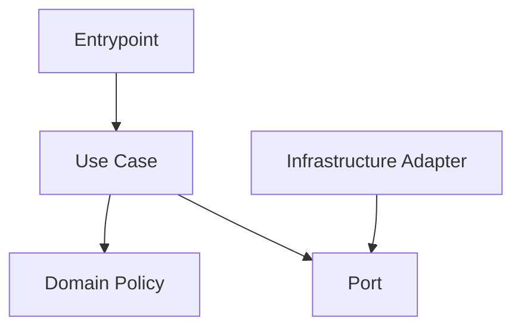

# Lộ trình học Design Pattern trong PHP

Lộ trình này biến repository thành một chương trình học có đầu ra kiểm chứng được. Không chuyển level chỉ vì đã đọc hết tài liệu; hãy chuyển level khi có **code, test, diagram và decision evidence**.

## Ma trận level

| Level | Câu hỏi phải trả lời được | Nội dung chính | Evidence hoàn thành |
|---|---|---|---|
| 0 | Dependency nào làm thay đổi lan rộng? | OOP, SOLID, coupling, cohesion, composition | Refactor một class có characterization test |
| 1 | Pattern bảo vệ change axis nào? | Strategy, Factory, Adapter, Observer, Decorator | Before/after + contract test + trade-off note |
| 2 | Nhiều pattern phối hợp mà không tạo framework nội bộ thế nào? | State, Command, Chain, Builder, Facade, Proxy | Workflow có diagram và failure test |
| 3 | Tách domain, use case, persistence và read model ra sao? | Repository, Query Object, Specification, UoW, Data Mapper | Use-case test độc lập framework + integration test adapter |
| 4 | Hệ thống xử lý duplicate, timeout, race và partial failure thế nào? | Outbox, Inbox, idempotency, saga, reconciliation | Failure matrix, metric, alert và runbook |
| 5 | Quyết định kiến trúc được governance và đảo ngược thế nào? | DDD, Clean Architecture, ADR, fitness function | ADR + migration plan + rollback + production evidence |

## Cách học một chủ đề

### Bước 1 — Đọc problem trước pattern

Ghi lại:

- actor và use case;
- invariant;
- thay đổi dự kiến;
- failure có thể xảy ra;
- baseline đơn giản nhất.

### Bước 2 — Chạy code before

Không refactor ngay. Viết characterization test để khóa behavior hiện tại. Nếu không mô tả được behavior thì chưa đủ dữ kiện thiết kế.

### Bước 3 — Vẽ dependency

Sơ đồ phải trả lời client biết ít đi điều gì sau refactor.

### Bước 4 — Implement và test theo boundary

- Unit test: invariant và policy.
- Contract test: mọi implementation của port/pattern.
- Integration test: database, SDK, queue hoặc framework lifecycle.
- Failure test: timeout, duplicate, stale version, rollback.

### Bước 5 — Ghi quyết định

Viết ADR ngắn: context, options, decision, consequences, verification và revisit criteria.

## Kế hoạch 8 tuần

| Tuần | Trọng tâm | Thực hành |
|---|---|---|
| 1 | OOP, SOLID, coupling/cohesion | `docs/00-foundations`, 3 kata refactor |
| 2 | Strategy, Factory, Adapter | examples + playground + exercise Foundation |
| 3 | Decorator, Observer, State | failure test và comparison note |
| 4 | Command, Chain, Builder, Facade | thiết kế workflow và review chéo |
| 5 | Repository, Query Object, Specification | tách write/read model |
| 6 | UoW, Outbox, Data Mapper | transaction/failure matrix |
| 7 | Payment, Inventory, Booking | production case study + runbook |
| 8 | DDD, Clean Architecture, ADR | capstone và architecture review |

## Các tuyến học

### Tự học

Bắt đầu tại [Foundations](../docs/00-foundations/README.md), sau đó dùng [Overview](../OVERVIEW.md) để chọn pattern. Mỗi tuần phải có ít nhất một artifact chạy được.

### Onboarding team

Dùng [Training](../training/README.md). Giảng viên nên demo failure trước, rồi mới giới thiệu pattern để tránh học thuộc cấu trúc class.

### Chuẩn bị phỏng vấn

Kết hợp [Interviews](../interviews/README.md), `examples/`, và live design scenarios. Câu trả lời tốt phải có trade-off và trường hợp không dùng pattern.

### Tech Lead

Tập trung `decisions/`, `production/`, `handbook/` và `docs/09-expert-practice/`. Đầu ra là decision packet có code/test/metric/runbook liên kết được.

## Definition of Done

Một level hoàn thành khi người học có thể:

- giải thích vấn đề mà không nhắc tên pattern trước;
- vẽ dependency và lifecycle;
- viết test cho happy/failure path;
- chỉ ra chi phí của abstraction;
- đề xuất baseline đơn giản hơn;
- trình bày migration và rollback nếu thay code production.
