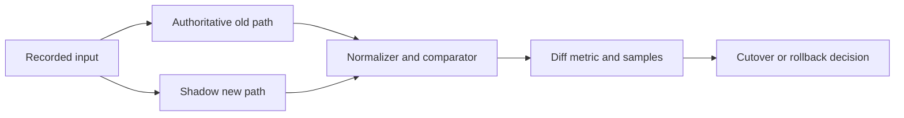

# Migration Rehearsal Lab

Lab dùng `DualRunComparator` để chạy implementation cũ và mới trên cùng input, normalize field không mang semantics và ghi diff.

Bài tập:

- Tạo 100 input đã redacted.
- Thêm mismatch critical/non-critical.
- Chặn side effect ở shadow path.
- Đặt cutover threshold và rollback trigger.
- Lưu review packet gồm diff, latency và resource usage.
