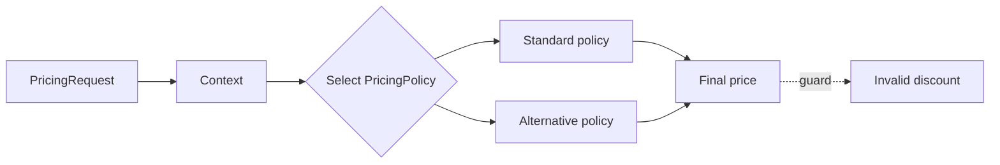

# Playground 6: Strategy — Pricing

## Mục tiêu học tập

Chạy một ví dụ nhỏ về **tính giá theo market và customer segment** và quan sát cách **Strategy** giúp tách thuật toán/policy có cùng contract. Playground này là drill 10–15 phút; flagship playground phù hợp hơn cho luồng nhiều bước.

Sau bài này, người học phải giải thích được **policy thay đổi độc lập** trong bối cảnh pricing, chỉ ra dependency đã bị đảo hoặc che giấu, và nêu trường hợp giải pháp trực tiếp vẫn tốt hơn.

## Bối cảnh và invariant

- **Nghiệp vụ:** base price, discount, tax và rounding.
- **Invariant:** giá cuối cùng phải giải thích được và không âm.
- **Change axis:** thêm policy mới mà không sửa client.
- **Failure bắt buộc quan sát:** rule conflict, currency mismatch hoặc rounding drift; ở mức pattern cần chú ý thêm policy bị chọn sai hoặc trả kết quả ngoài miền hợp lệ.



## Cách chạy

```bash
php playground/006-strategy-pricing/index.php
```

Trước khi chạy, dự đoán output và ghi lại concrete detail mà client đang biết. Sau khi chạy, đối chiếu xem **chọn thuật toán qua contract** đã làm client biết ít đi điều gì, đồng thời kiểm tra invariant của pricing vẫn được giữ.

## Thử nghiệm có hướng dẫn

1. Chạy baseline và lưu output/error hiện tại.
2. Thêm promotion chồng lấn và kiểm tra explanation breakdown.
3. Tạo failure **rule conflict, currency mismatch hoặc rounding drift** và yêu cầu lỗi được biểu diễn rõ, không silent fallback.
4. Viết test tập trung vào **giá cuối cùng phải giải thích được và không âm**.
5. Thử bỏ abstraction; nếu code trực tiếp vẫn rõ và change axis chưa tồn tại, ghi lại lý do chưa áp dụng Strategy.

## Câu hỏi review

- Trong miền pricing, phần nào là policy/domain rule và phần nào chỉ là wiring?
- Strategy bảo vệ thay đổi **thêm policy mới mà không sửa client** bằng cơ chế nào?
- Failure **rule conflict, currency mismatch hoặc rounding drift** được phát hiện, dịch và quan sát ở boundary nào?
- Abstraction có làm invariant **giá cuối cùng phải giải thích được và không âm** dễ test hơn không?
- Complexity mới xuất hiện ở đâu: số class, ordering, lifecycle hay debugging?

## Kết quả mong đợi

Một lời giải đạt yêu cầu phải chứng minh flow pricing vẫn giữ invariant khi thay implementation strategy, có assertion cho failure đã nêu và giải thích được trade-off của boundary mới. Không chấm điểm dựa trên số lượng interface hoặc class.
