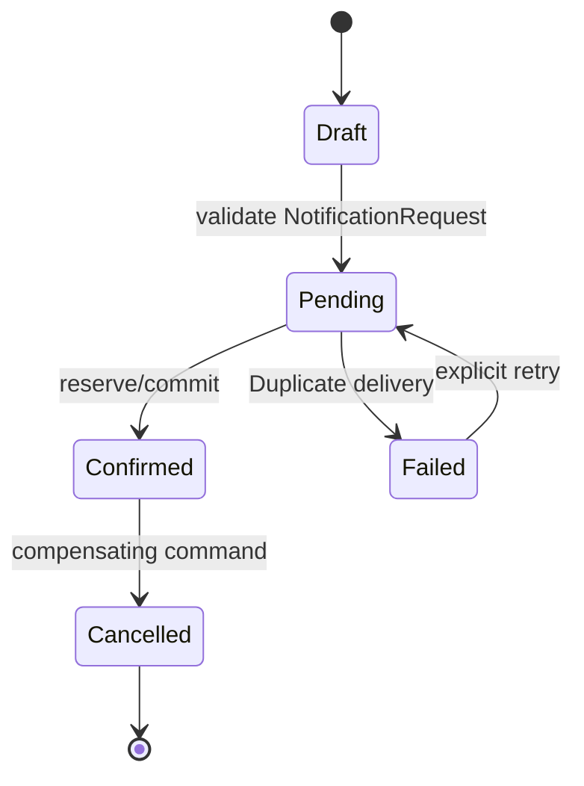

# Playground 48: State — Notification

## Mục tiêu học tập

Chạy một ví dụ nhỏ về **gửi email/SMS/Chatwork theo preference** và quan sát cách **State** giúp đưa hành vi/transition vào state object. Playground này là drill 10–15 phút; flagship playground phù hợp hơn cho luồng nhiều bước.

Sau bài này, người học phải giải thích được **hành vi thay đổi theo lifecycle** trong bối cảnh notification, chỉ ra dependency đã bị đảo hoặc che giấu, và nêu trường hợp giải pháp trực tiếp vẫn tốt hơn.

## Bối cảnh và invariant

- **Nghiệp vụ:** channel, template, recipient và delivery result.
- **Invariant:** mỗi notification có delivery identity và trạng thái rõ.
- **Change axis:** thêm state/transition mà không tạo switch lớn.
- **Failure bắt buộc quan sát:** provider rate limit, duplicate delivery hoặc invalid recipient; ở mức pattern cần chú ý thêm illegal transition hoặc side effect chạy sai thời điểm.



## Cách chạy

```bash
php playground/048-state-notification/index.php
```

Trước khi chạy, dự đoán output và ghi lại concrete detail mà client đang biết. Sau khi chạy, đối chiếu xem **mỗi state sở hữu transition hợp lệ** đã làm client biết ít đi điều gì, đồng thời kiểm tra invariant của notification vẫn được giữ.

## Thử nghiệm có hướng dẫn

1. Chạy baseline và lưu output/error hiện tại.
2. Mô phỏng retry và chứng minh không gửi trùng.
3. Tạo failure **provider rate limit, duplicate delivery hoặc invalid recipient** và yêu cầu lỗi được biểu diễn rõ, không silent fallback.
4. Viết test tập trung vào **mỗi notification có delivery identity và trạng thái rõ**.
5. Thử bỏ abstraction; nếu code trực tiếp vẫn rõ và change axis chưa tồn tại, ghi lại lý do chưa áp dụng State.

## Câu hỏi review

- Trong miền notification, phần nào là policy/domain rule và phần nào chỉ là wiring?
- State bảo vệ thay đổi **thêm state/transition mà không tạo switch lớn** bằng cơ chế nào?
- Failure **provider rate limit, duplicate delivery hoặc invalid recipient** được phát hiện, dịch và quan sát ở boundary nào?
- Abstraction có làm invariant **mỗi notification có delivery identity và trạng thái rõ** dễ test hơn không?
- Complexity mới xuất hiện ở đâu: số class, ordering, lifecycle hay debugging?

## Kết quả mong đợi

Một lời giải đạt yêu cầu phải chứng minh flow notification vẫn giữ invariant khi thay implementation state, có assertion cho failure đã nêu và giải thích được trade-off của boundary mới. Không chấm điểm dựa trên số lượng interface hoặc class.
